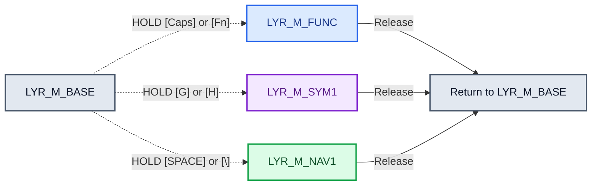
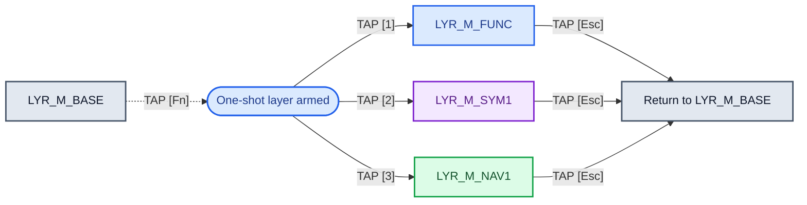

# Keychron B1 Pro (ANSI) ZMK Keymap Specification

This document defines the Keychron B1 Pro's intended ZMK keymap. The active
firmware source is `app/boards/shields/keychron/b1/us/keychron_b1_us.keymap`.
The diagrams are a specification: a binding is only implemented once it also
exists in that keymap and passes the focused validator.

## Canonical ZMK layer convention

ZMK addresses a layer by its **zero-based numeric index**. In a keymap,
`&mo`, `&lt`, and `&to` receive that index (or a C preprocessor constant that
expands to it). The devicetree node label, such as `layer_num`, is a
project-defined identifier, not a separate ZMK layer number.

Use these names and indices everywhere in this project:

| Index | Canonical constant | ZMK node     | Status                                         |
| ----: | ------------------ | ------------ | ---------------------------------------------- |
|     0 | `LYR_M_BASE`       | `LYR_M_BASE` | SWTICH TOGGLE MAC: Implemented default layer   |
|     1 | `LYR_M_FUNC`       | `LYR_M_FUNC` | Implemented factory Function layer & numpad    |
|     2 | `LYR_M_SYM1`       | `LYR_M_SYM1` | Implemented combined Symbols layer             |
|     3 | `LYR_M_NAV1`       | `LYR_M_NAV1` | Navigation; no node/bindings yet               |
|     4 | `LYR_M_RES1`       | `LYR_M_RES1` | RESERVED - CREATE BUT DO NOT USE               |
|     5 | `LYR_M_RES2`       | `LYR_M_RES2` | RESERVED - CREATE BUT DO NOT USE               |
|     6 | `LYR_M_BASE`       | `LYR_M_BASE` | SWTICH TOGGLE WIN:                             |
|     7 | `LYR_M_FUNC`       | `LYR_M_FUNC` | WIN: Functions, Layer switchers and Numpad     |
|     8 | `LYR_M_SYM1`       | `LYR_M_SYM1` | WIN: Symbols                                   |
|     9 | `LYR_M_NAV1`       | `LYR_M_NAV1` | WIN: Navigation                                |
|    10 | `LYR_M_RES1`       | `LYR_M_RES1` | RESERVED - CREATE BUT DO NOT USE               |
|    11 | `LYR_M_RES2`       | `LYR_M_RES2` | RESERVED - CREATE BUT DO NOT USE               |

---

## Temporary Layer Access: User Workflow
This workflow enables the user to access the various layers while holding down a designated LAYER_ACTIVATION_KEY assigned to each layer. When the user releases the key, the keyboard will switch back to LYR_M_BASE. The LAYER_ACTIVATION_KEYS are:

| LAYER Access | Temp Activation Keys |
|-------------:|:---------------------|
**LYR_M_FUNC** |  **[CAPS]** OR **[Fn]**
**LYR_M_SYM1** | **[G]** OR **[H]**
**LYR_M_NAV1** | **[SPACE]** or **[\\]**



### Persistent Layer Access: User Workflow
1. The user will TAP the [Fn] key for One-Shot Access to Layer 1 (LYR_M_FUNC)
2. User taps the Number Row [1], [2], or [3]:
    a. [1] will switch to the LYR_M_FUNC.
    b. [2] will switch to the LYR_M_SYM1.
    c. [3] will switch to the LYR_M_NAV1.
3. From within the 3 layers (LYR_M_FUNC, LYR_M_SYM1, LYR_M_NAV1), the [Esc] is configured to switch the kayboard back to LYR_M_BASE.
  


## Layer Index 0: #define LYR_M_BASE

- **How Activated:** Default active layer.
- **Desired explicit dual-role definitions:**

  | Physical key | Tap action | Hold action | VIA interpretation | Specification status |
  | --- | --- | --- | --- | --- |
  | **[CAPS]** | `Esc` | Temporarily activate `LYR_M_FUNC`; releasing the key returns to `LYR_M_BASE`. | `LT(1, KC_ESC)` | Desired; firmware change required. |
  | **[Esc]** | `Esc` | After more than 600 ms, toggle `Caps Lock`. | No direct VIA `LT` equivalent; requires a ZMK custom hold-tap behavior. | Desired; firmware change required. |

- **Special Dual-Role Keys:**
  - **Tab:** Taps as `Tab`, holds as **Hyper** (`Cmd + Alt + Ctrl + Shift`).
  - **Caps Lock:** Taps as `Escape`, holds **Layer 1 — Function and Numpad** (`LYR_M_FUNC`) only while held, then returns to `LYR_M_BASE` on release.
  - **Escape:** Taps as `Escape`; a hold longer than 600 ms toggles `Caps Lock`.
  - **Spacebar:** Currently sends `Space`; hold **Layer 4 — Navigation** (`LYR_M_NAV1`) is planned, not implemented.
  - **G** and **H:** Each taps as its letter and holds the shared **Layer 3 — Symbols** (`LYR_M_SYM1`).
  - **Z:** Currently sends plain `z`; it is not an Fn layer-tap.
  - **Physical Fn key:** Holds **Layer 1 — Function** (`LAYER_FN`).
  - **Home Row Modifiers:** Taps as character, holds as modifier on opposite-hand presses:
    - `A`/`S`/`D`/`F` $\rightarrow$ `Ctrl`/`Cmd`/`Alt`/`Shift`
    - `J`/`K`/`L`/`;` $\rightarrow$ `Shift`/`Alt`/`Cmd`/`Ctrl`

```text
  ┏━━━━━━━━━━━┳━━━━━━━━━┳━━━━━━━━━┳━━━━━━━━━┳━━━━━━━━━┳━━━━━━━━━┳━━━━━━━━━┳━━━━━━━━━┳━━━━━━━━━┳━━━━━━━━━┳━━━━━━━━━┳━━━━━━━━━┳━━━━━━━━━┳━━━━━━━━┓
  ┃           ┃         ┃         ┃         ┃         ┃         ┃         ┃         ┃         ┃         ┃         ┃         ┃         ┃        ┃
  ┃TAP: ESC   ┃   F1    ┃   F2    ┃   F3    ┃   F4    ┃   F5    ┃   F6    ┃    F7   ┃    F8   ┃    F9   ┃   F10   ┃   F11   ┃   F12   ┃  DEL   ┃
  ┃HOLD: CAPS ┃         ┃         ┃         ┃         ┃         ┃         ┃         ┃         ┃         ┃         ┃         ┃         ┃        ┃
  ┃           ┃         ┃         ┃         ┃         ┃         ┃         ┃         ┃         ┃         ┃         ┃         ┃         ┃        ┃
  ┣━━━━━━━┳━━━┻━━━━━┳━━━┻━━━━━┳━━━┻━━━━━┳━━━┻━━━━━┳━━━┻━━━━━┳━━━┻━━━━━┳━━━┻━━━━━┳━━━┻━━━━━┳━━━┻━━━━━┳━━━┻━━━━━┳━━━┻━━━━━┳━━━┻━━━━━┳━━━┻━━━━━━━━┫
  ┃   ~   ┃    !    ┃    @    ┃    #    ┃    $    ┃    %    ┃    ^    ┃    *    ┃    -    ┃    (    ┃    )    ┃    _    ┃    +    ┃            ┃
  ┃   `   ┃    1    ┃    2    ┃    3    ┃    4    ┃    5    ┃    6    ┃    7    ┃    8    ┃    9    ┃    0    ┃    -    ┃    =    ┃    BKSP    ┃
  ┃       ┃         ┃         ┃         ┃         ┃         ┃         ┃         ┃         ┃         ┃         ┃         ┃         ┃            ┃
  ┣━━━━━━━┻━━┳━━━━━━┻━━┳━━━━━━┻━━┳━━━━━━┻━━┳━━━━━━┻━━┳━━━━━━┻━━┳━━━━━━┻━━┳━━━━━━┻━━┳━━━━━━┻━━┳━━━━━━┻━━┳━━━━━━┻━━┳━━━━━━┻━━┳━━━━━━┻━━┳━━━━━━━━━┫
  ┃TAP: TAB  ┃         ┃         ┃         ┃         ┃         ┃         ┃         ┃         ┃         ┃         ┃    {    ┃    }    ┃    |    ┃
  ┃HOLD: HYPR┃    Q    ┃    W    ┃    E    ┃    R    ┃    T    ┃    Y    ┃    U    ┃    I    ┃    O    ┃    P    ┃    [    ┃    ]    ┃    \    ┃
  ┃          ┃         ┃         ┃         ┃         ┃         ┃         ┃         ┃         ┃         ┃         ┃         ┃         ┃         ┃
  ┣━━━━━━━━━━┻┳━━━━━━━━┻┳━━━━━━━━┻┳━━━━━━━━┻┳━━━━━━━━┻┳━━━━━━━━┻┳━━━━━━━━┻┳━━━━━━━━┻┳━━━━━━━━┻┳━━━━━━━━┻┳━━━━━━━━┻┳━━━━━━━━┻┳━━━━━━━━┻━━━━━━━━━┫
  ┃TAP=ESC    ┃ TAP=A   ┃ TAP=S   ┃ TAP=D   ┃ TAP=F   ┃ TAP=G   ┃ TAP=H   ┃ TAP=J   ┃ TAP=K   ┃ TAP=L   ┃ TAP=;/: ┃    "    ┃                  ┃
  ┃HOLD:MO(1) ┃ HLD=    ┃ HLD=    ┃ HLD=    ┃ HLD=    ┃ HLD=    ┃ HLD=    ┃ HLD=    ┃ HLD=    ┃ HLD=    ┃ HLD=    ┃    '    ┃      RETURN      ┃
  ┃           ┃  L_CTRL ┃  L_GUI  ┃  L_ALT  ┃ L_SHIFT ┃   MO(2) ┃   MO(2) ┃ R_SHIFT ┃  R_ALT  ┃  R_GUI  ┃  R_CTRL ┃         ┃                  ┃
  ┣━━━━━━━━━━━┻━━┳━━━━━━┻━━┳━━━━━━┻━━┳━━━━━━┻━━┳━━━━━━┻━━┳━━━━━━┻━━┳━━━━━━┻━━┳━━━━━━┻━━┳━━━━━━┻━━┳━━━━━━┻━━┳━━━━━━┻━━┳━━━━━━┻━━━━━━━━━━━━━━━━━━┫
  ┃              ┃         ┃         ┃         ┃         ┃         ┃         ┃         ┃    <    ┃    >    ┃    ?    ┃                         ┃
  ┃   L_SHIFT    ┃    Z    ┃    X    ┃    C    ┃    V    ┃    B    ┃   N     ┃    M    ┃    ,    ┃    .    ┃    /    ┃        R_SHIFT          ┃
  ┃              ┃         ┃         ┃         ┃         ┃         ┃         ┃         ┃         ┃         ┃         ┃                         ┃
  ┣━━━━━━━━━━━┳━━┻━━━━━━━┳━┻━━━━━━━━━╋━━━━━━━━━┻━━━━━━━━━┻━━━━━━━━━┻━━━━━━━━━┻━━━━━━━━━╋━━━━━━━━━┻━━━━┳━━━━┻━━━━━┳━┳━┻━━━━━━┳━━━━━━━━━┳━━━━━━━━┫
  ┃           ┃          ┃           ┃                                                 ┃              ┃TAP:OSL(1)┃ ┃        ┃    ↑    ┃        ┃
  ┃  L_CTRL   ┃  L_ALT   ┃   L_CMD   ┃               * LT MAC_LNAV SPACE *             ┃    R_CMD     ┃HOLD:MO(1)┃ ┃    ←   ┣━━━━━━━━━┫   →    ┃
  ┃           ┃          ┃           ┃                                                 ┃              ┃          ┃ ┃        ┃    ↓    ┃        ┃
  ┗━━━━━━━━━━━┻━━━━━━━━━━┻━━━━━━━━━━━┻━━━━━━━━━━━━━━━━━━━━━━━━━━━━━━━━━━━━━━━━━━━━━━━━━┻━━━━━━━━━━━━━━┻━━━━━━━━━━┛ ┗━━━━━━━━┻━━━━━━━━━┻━━━━━━━━┛
```

---

## Layer Index 1: Functions and Numpad (`LYR_M_FUNC`, `LYR_M_FUNC`)

- **How Activated:** Hold **Caps Lock** (taps as `Esc`).
- **Description:** Turns the top alpha row into a horizontal number line (`1` to `9`) and standard mathematical operators, with navigation and control keys on the right hand. Left hand home row contains Callum-style one-shot modifiers.
- **Persistent layer selection:** The number-row **[1]**, **[2]**, and **[3]** keys use `TO(1)`, `TO(2)`, and `TO(3)` respectively to select `LYR_M_FUNC`, `LYR_M_SYM1`, or `LYR_M_NAV1`.
- **Bluetooth profile controls — desired behavior:**

  | Key | Tap | Double-tap |
  | --- | --- | --- |
  | **[Q]** | Select Bluetooth profile 1. | Start discovery/pairing for Bluetooth profile 1. |
  | **[W]** | Select Bluetooth profile 2. | Start discovery/pairing for Bluetooth profile 2. |
  | **[E]** | Select Bluetooth profile 3. | Start discovery/pairing for Bluetooth profile 3. |

  The double-tap pairing actions are a desired tap-dance behavior and require
  implementation and timing validation in the ZMK keymap.

```text
  ┏━━━━━━━━━━━┳━━━━━━━━━┳━━━━━━━━━┳━━━━━━━━━┳━━━━━━━━━┳━━━━━━━━━┳━━━━━━━━━┳━━━━━━━━━┳━━━━━━━━━┳━━━━━━━━━┳━━━━━━━━━┳━━━━━━━━━┳━━━━━━━━━┳━━━━━━━━┓
  ┃           ┃         ┃         ┃ MISSION ┃         ┃         ┃         ┃  SCREEN ┃ PLAY/   ┃  TOGGLE ┃         ┃         ┃         ┃        ┃
  ┃   TO(0)   ┃ Bright+ ┃ Bright- ┃ CONTORL ┃  FINDER ┃ ALT+SPC ┃ ACTIVTY ┃   SHOT  ┃  PAUSE  ┃   MIC   ┃   MUTE  ┃   Vol-  ┃  Vol+   ┃   DEL  ┃
  ┃           ┃         ┃         ┃         ┃         ┃         ┃         ┃         ┃         ┃         ┃         ┃         ┃         ┃        ┃
  ┣━━━━━━━┳━━━┻━━━━━┳━━━┻━━━━━┳━━━┻━━━━━┳━━━┻━━━━━┳━━━┻━━━━━┳━━━┻━━━━━┳━━━┻━━━━━┳━━━┻━━━━━┳━━━┻━━━━━┳━━━┻━━━━━┳━━━┻━━━━━┳━━━┻━━━━━┳━━━┻━━━━━━━━┫
  ┃       ┃         ┃         ┃         ┃  2.4G   ┃         ┃ NUMPAD  ┃ NUMPAD  ┃ NUMPAD  ┃ NUMPAD  ┃         ┃         ┃         ┃            ┃
  ┃    ▼  ┃  TO(1)  ┃  TO(2)  ┃  TO(3)  ┃  PAIR   ┃    ▼    ┃    ÷    ┃    ×    ┃    −    ┃    +    ┃     ▼   ┃   Boot  ┃    ▼    ┃     ▼      ┃
  ┃       ┃         ┃         ┃         ┃         ┃         ┃         ┃         ┃         ┃         ┃         ┃         ┃         ┃            ┃
  ┣━━━━━━━┻━━┳━━━━━━┻━━┳━━━━━━┻━━┳━━━━━━┻━━┳━━━━━━┻━━┳━━━━━━┻━━┳━━━━━━┻━━┳━━━━━━┻━━┳━━━━━━┻━━┳━━━━━━┻━━┳━━━━━━┻━━┳━━━━━━┻━━┳━━━━━━┻━━┳━━━━━━━━━┫
  ┃          ┃         ┃         ┃         ┃         ┃         ┃ NUMPAD  ┃ NUMPAD  ┃ NUMPAD  ┃         ┃         ┃         ┃         ┃         ┃
  ┃     ▼    ┃TAP:BT1  ┃TAP:BT2  ┃TAP:BT3  ┃    ▼    ┃ DELETE  ┃    7    ┃    8    ┃    9    ┃BACKSPACE┃     ▼   ┃     ▼   ┃    ▼    ┃   Prt   ┃
  ┃          ┃DBL:PAIR1┃DBL:PAIR2┃DBL:PAIR3┃         ┃         ┃         ┃         ┃         ┃         ┃         ┃         ┃         ┃  Scrn   ┃
  ┃          ┃         ┃         ┃         ┃         ┃         ┃         ┃         ┃         ┃         ┃         ┃         ┃         ┃         ┃
  ┣━━━━━━━━━━┻┳━━━━━━━━┻┳━━━━━━━━┻┳━━━━━━━━┻┳━━━━━━━━┻┳━━━━━━━━┻┳━━━━━━━━┻┳━━━━━━━━┻┳━━━━━━━━┻┳━━━━━━━━┻┳━━━━━━━━┻┳━━━━━━━━┻┳━━━━━━━━┻━━━━━━━━━┫
  ┃  LAYER    ┃         ┃         ┃         ┃         ┃         ┃ NUMPAD  ┃ NUMPAD  ┃ NUMPAD  ┃ NUMPAD  ┃         ┃         ┃                  ┃
  ┃  ACTIVATE ┃  L_CTRL ┃  L_GUI  ┃  L_ALT  ┃ L_SHIFT ┃     ▼   ┃   TAB   ┃    4    ┃    5    ┃    6    ┃  ENTER  ┃     ▼   ┃         ▼        ┃
  ┃           ┃         ┃         ┃         ┃         ┃         ┃         ┃         ┃         ┃         ┃         ┃         ┃                  ┃
  ┣━━━━━━━━━━━┻━━┳━━━━━━┻━━┳━━━━━━┻━━┳━━━━━━┻━━┳━━━━━━┻━━┳━━━━━━┻━━┳━━━━━━┻━━┳━━━━━━┻━━┳━━━━━━┻━━┳━━━━━━┻━━┳━━━━━━┻━━┳━━━━━━┻━━━━━━━━━━━━━━━━━━┫
  ┃              ┃         ┃         ┃         ┃         ┃         ┃         ┃ NUMPAD  ┃ NUMPAD  ┃ NUMPAD  ┃ NUMPAD  ┃      TAP: Emoji-m       ┃
  ┃        ▼     ┃     ▼   ┃     ▼   ┃     ▼   ┃    ▼    ┃    ▼    ┃    ,    ┃    1    ┃    2    ┃    3    ┃    .    ┃     HOLD: R_SHIFT       ┃
  ┃              ┃         ┃         ┃         ┃         ┃         ┃         ┃         ┃         ┃         ┃         ┃                         ┃
  ┣━━━━━━━━━━━┳━━┻━━━━━━━┳━┻━━━━━━━━━╋━━━━━━━━━┻━━━━━━━━━┻━━━━━━━━━┻━━━━━━━━━┻━━━━━━━━━╋━━━━━━━━━┻━━━━┳━━━━┻━━━━━┳━┳━┻━━━━━━┳━━━━━━━━━┳━━━━━━━━┫
  ┃           ┃          ┃           ┃                     NUMPAD                      ┃              ┃          ┃ ┃        ┃  PgUp   ┃        ┃
  ┃  L_CTRL   ┃  L_GUI   ┃   L_ALT   ┃                        0                        ┃    R_ALT     ┃     ▼    ┃ ┃  Home  ┣━━━━━━━━━┫   End  ┃
  ┃           ┃          ┃           ┃                                                 ┃              ┃          ┃ ┃        ┃  PgDn   ┃        ┃
  ┗━━━━━━━━━━━┻━━━━━━━━━━┻━━━━━━━━━━━┻━━━━━━━━━━━━━━━━━━━━━━━━━━━━━━━━━━━━━━━━━━━━━━━━━┻━━━━━━━━━━━━━━┻━━━━━━━━━━┛ ┗━━━━━━━━┻━━━━━━━━━┻━━━━━━━━┛

```

---

## Layer Index 2: Symbols (`LYR_M_SYM1`, `LYR_M_SYM1`)
- **How Activated:** Hold **`H`** (tapped as `h`), or Hold **`G`** (tapped as `g`).
- **Description:** Accesses easy-access symbols layer. Note that the

```text
  ┏━━━━━━━━━━━┳━━━━━━━━━┳━━━━━━━━━┳━━━━━━━━━┳━━━━━━━━━┳━━━━━━━━━┳━━━━━━━━━┳━━━━━━━━━┳━━━━━━━━━┳━━━━━━━━━┳━━━━━━━━━┳━━━━━━━━━┳━━━━━━━━━┳━━━━━━━━┓
  ┃           ┃         ┃         ┃         ┃         ┃         ┃         ┃         ┃         ┃         ┃         ┃         ┃         ┃        ┃
  ┃   TO(0)   ┃    _    ┃    _    ┃    _    ┃    _    ┃    _    ┃    _    ┃    _    ┃    _    ┃    _    ┃    _    ┃  CTRL+- ┃  CTRL+= ┃ CTRL+0 ┃
  ┃           ┃         ┃         ┃         ┃         ┃         ┃         ┃         ┃         ┃         ┃         ┃         ┃         ┃        ┃
  ┣━━━━━━━┳━━━┻━━━━━┳━━━┻━━━━━┳━━━┻━━━━━┳━━━┻━━━━━┳━━━┻━━━━━┳━━━┻━━━━━┳━━━┻━━━━━┳━━━┻━━━━━┳━━━┻━━━━━┳━━━┻━━━━━┳━━━┻━━━━━┳━━━┻━━━━━┳━━━┻━━━━━━━━┫
  ┃       ┃         ┃         ┃         ┃         ┃         ┃         ┃         ┃         ┃         ┃         ┃         ┃         ┃            ┃
  ┃   _   ┃    _    ┃    _    ┃    -    ┃    -    ┃    _    ┃    _    ┃    _    ┃    _    ┃    _    ┃    -    ┃    -    ┃    -    ┃     _      ┃
  ┃       ┃         ┃         ┃         ┃         ┃         ┃         ┃         ┃         ┃         ┃         ┃         ┃         ┃            ┃
  ┣━━━━━━━┻━━┳━━━━━━┻━━┳━━━━━━┻━━┳━━━━━━┻━━┳━━━━━━┻━━┳━━━━━━┻━━┳━━━━━━┻━━┳━━━━━━┻━━┳━━━━━━┻━━┳━━━━━━┻━━┳━━━━━━┻━━┳━━━━━━┻━━┳━━━━━━┻━━┳━━━━━━━━━┫
  ┃          ┃         ┃         ┃         ┃         ┃         ┃         ┃         ┃         ┃         ┃         ┃         ┃         ┃         ┃
  ┃     `    ┃    !    ┃    @    ┃    #    ┃    $    ┃    %    ┃    ^    ┃    &    ┃    *    ┃    -    ┃    _    ┃    +    ┃    }    ┃    |    ┃
  ┃          ┃         ┃         ┃         ┃         ┃         ┃         ┃         ┃         ┃         ┃         ┃         ┃         ┃         ┃
  ┣━━━━━━━━━━┻┳━━━━━━━━┻┳━━━━━━━━┻┳━━━━━━━━┻┳━━━━━━━━┻┳━━━━━━━━┻┳━━━━━━━━┻┳━━━━━━━━┻┳━━━━━━━━┻┳━━━━━━━━┻┳━━━━━━━━┻┳━━━━━━━━┻┳━━━━━━━━┻━━━━━━━━━┫
  ┃           ┃         ┃         ┃         ┃         ┃    *    ┃   *     ┃ 1TAP: ( ┃ 1TAP: { ┃ 1TAP: [ ┃         ┃         ┃                  ┃
  ┃     ~     ┃   CTRl  ┃    GUI  ┃   Alt   ┃  Shift  ┃  SYMBOL ┃ SYMBOL  ┃ 2TAP: ) ┃ 2TAP: } ┃ 2TAP: ] ┃    :    ┃    "    ┃        =         ┃
  ┃           ┃         ┃         ┃         ┃         ┃    *    ┃   *     ┃ 3TAP: ()┃ 3TAP: {}┃ 3TAP: []┃         ┃         ┃                  ┃
  ┣━━━━━━━━━━━┻━━┳━━━━━━┻━━┳━━━━━━┻━━┳━━━━━━┻━━┳━━━━━━┻━━┳━━━━━━┻━━┳━━━━━━┻━━┳━━━━━━┻━━┳━━━━━━┻━━┳━━━━━━┻━━┳━━━━━━┻━━┳━━━━━━┻━━━━━━━━━━━━━━━━━━┫
  ┃              ┃         ┃         ┃         ┃         ┃         ┃         ┃         ┃         ┃         ┃         ┃                         ┃
  ┃   L_SHIFT    ┃         ┃         ┃         ┃         ┃         ┃         ┃         ┃    <    ┃    >    ┃    ?    ┃         R_SHIFT         ┃
  ┃              ┃         ┃         ┃         ┃         ┃         ┃         ┃         ┃         ┃         ┃         ┃                         ┃
  ┣━━━━━━━━━━━┳━━┻━━━━━━━┳━┻━━━━━━━━━╋━━━━━━━━━┻━━━━━━━━━┻━━━━━━━━━┻━━━━━━━━━┻━━━━━━━━━╋━━━━━━━━━┻━━━━┳━━━━┻━━━━━┳━┳━┻━━━━━━┳━━━━━━━━━┳━━━━━━━━┫
  ┃           ┃          ┃           ┃                                                 ┃              ┃          ┃ ┃        ┃    ↑    ┃        ┃
  ┃  L_CTRL   ┃  L_GUI   ┃   L_ALT   ┃                      SPACE                      ┃    R_ALT     ┃  R_CTRL  ┃ ┃    ←   ┣━━━━━━━━━┫   →    ┃
  ┃           ┃          ┃           ┃                                                 ┃              ┃          ┃ ┃        ┃    ↓    ┃        ┃
  ┗━━━━━━━━━━━┻━━━━━━━━━━┻━━━━━━━━━━━┻━━━━━━━━━━━━━━━━━━━━━━━━━━━━━━━━━━━━━━━━━━━━━━━━━┻━━━━━━━━━━━━━━┻━━━━━━━━━━┛ ┗━━━━━━━━┻━━━━━━━━━┻━━━━━━━━┛
```

---

## Layer Index 3: Navigation (`LYR_M_NAV1`)

> **Specification status:** This layer is not implemented in the active
> keymap. The diagram below is a proposed target layout, not a description of
> current firmware behavior.

- **Desired activation:** Hold **Spacebar** (tapped as `Space`).
- **Target description:** Re-map the right hand to navigation keys (Arrows,
  Home, End, Page Up, Page Down) and the left hand to standard modifiers so
  text can be navigated and selected without leaving the home row.

```text
  ┏━━━━━━━━━━━┳━━━━━━━━━┳━━━━━━━━━┳━━━━━━━━━┳━━━━━━━━━┳━━━━━━━━━┳━━━━━━━━━┳━━━━━━━━━┳━━━━━━━━━┳━━━━━━━━━┳━━━━━━━━━┳━━━━━━━━━┳━━━━━━━━━┳━━━━━━━━┓
  ┃           ┃         ┃         ┃         ┃         ┃         ┃         ┃         ┃         ┃         ┃         ┃         ┃         ┃        ┃
  ┃   TO(0)   ┃   F13   ┃   F14   ┃   F15   ┃   F16   ┃   F17   ┃   F18   ┃   F19   ┃   F20   ┃   F21   ┃   F22   ┃   F23   ┃   F24   ┃        ┃
  ┃           ┃         ┃         ┃         ┃         ┃         ┃         ┃         ┃         ┃         ┃         ┃         ┃         ┃        ┃
  ┣━━━━━━━┳━━━┻━━━━━┳━━━┻━━━━━┳━━━┻━━━━━┳━━━┻━━━━━┳━━━┻━━━━━┳━━━┻━━━━━┳━━━┻━━━━━┳━━━┻━━━━━┳━━━┻━━━━━┳━━━┻━━━━━┳━━━┻━━━━━┳━━━┻━━━━━┳━━━┻━━━━━━━━┫
  ┃       ┃         ┃         ┃         ┃         ┃         ┃         ┃         ┃         ┃         ┃         ┃         ┃         ┃            ┃
  ┃       ┃         ┃         ┃    #    ┃   MW ↓  ┃         ┃         ┃         ┃         ┃         ┃  MBtn1  ┃ Mouse ↑ ┃  MBtn2  ┃            ┃
  ┃       ┃         ┃         ┃         ┃         ┃         ┃         ┃         ┃         ┃         ┃         ┃         ┃         ┃            ┃
  ┣━━━━━━━┻━━┳━━━━━━┻━━┳━━━━━━┻━━┳━━━━━━┻━━┳━━━━━━┻━━┳━━━━━━┻━━┳━━━━━━┻━━┳━━━━━━┻━━┳━━━━━━┻━━┳━━━━━━┻━━┳━━━━━━┻━━┳━━━━━━┻━━┳━━━━━━┻━━┳━━━━━━━━━┫
  ┃          ┃         ┃         ┃         ┃         ┃         ┃         ┃         ┃         ┃         ┃         ┃         ┃         ┃         ┃****
  ┃          ┃ Alt+F4  ┃ CTRL+W  ┃  MW ←   ┃  MW ↑   ┃  MW →   ┃ CTRL+Y  ┃   Dele  ┃    ↑    ┃  Bksp   ┃ Mouse ← ┃ Mouse ↓ ┃ Mouse → ┃         ┃
  ┃          ┃         ┃         ┃         ┃         ┃         ┃         ┃         ┃         ┃         ┃         ┃         ┃         ┃         ┃
  ┣━━━━━━━━━━┻┳━━━━━━━━┻┳━━━━━━━━┻┳━━━━━━━━┻┳━━━━━━━━┻┳━━━━━━━━┻┳━━━━━━━━┻┳━━━━━━━━┻┳━━━━━━━━┻┳━━━━━━━━┻┳━━━━━━━━┻┳━━━━━━━━┻┳━━━━━━━━┻━━━━━━━━━┫
  ┃           ┃         ┃         ┃         ┃         ┃         ┃         ┃         ┃         ┃         ┃         ┃         ┃                  ┃
  ┃           ┃   CTRl  ┃    GUI  ┃   Alt   ┃  Shift  ┃         ┃   Home  ┃    ←    ┃    ↓    ┃    →    ┃   End   ┃         ┃                  ┃
  ┃           ┃         ┃         ┃         ┃         ┃         ┃         ┃         ┃         ┃         ┃         ┃         ┃                  ┃
  ┣━━━━━━━━━━━┻━━┳━━━━━━┻━━┳━━━━━━┻━━┳━━━━━━┻━━┳━━━━━━┻━━┳━━━━━━┻━━┳━━━━━━┻━━┳━━━━━━┻━━┳━━━━━━┻━━┳━━━━━━┻━━┳━━━━━━┻━━┳━━━━━━┻━━━━━━━━━━━━━━━━━━┫
  ┃              ┃         ┃         ┃         ┃         ┃         ┃         ┃         ┃         ┃         ┃         ┃                         ┃
  ┃              ┃         ┃ CTRL+X  ┃ CTRL+C  ┃ CTRL+V  ┃ CTRL+B  ┃  PgUp   ┃  PgDn   ┃         ┃         ┃         ┃                         ┃
  ┃              ┃         ┃         ┃         ┃         ┃         ┃         ┃         ┃         ┃         ┃         ┃                         ┃
  ┣━━━━━━━━━━━┳━━┻━━━━━━━┳━┻━━━━━━━━━╋━━━━━━━━━┻━━━━━━━━━┻━━━━━━━━━┻━━━━━━━━━┻━━━━━━━━━╋━━━━━━━━━┻━━━━┳━━━━┻━━━━━┳━┳━┻━━━━━━┳━━━━━━━━━┳━━━━━━━━┫
  ┃           ┃          ┃           ┃                                                 ┃              ┃          ┃ ┃        ┃         ┃        ┃
  ┃   MSPD1   ┃   MSPD2  ┃   MSPD3   ┃                   [Activator]                   ┃              ┃          ┃ ┃        ┣━━━━━━━━━┫        ┃
  ┃           ┃          ┃           ┃                                                 ┃              ┃          ┃ ┃        ┃         ┃        ┃
  ┗━━━━━━━━━━━┻━━━━━━━━━━┻━━━━━━━━━━━┻━━━━━━━━━━━━━━━━━━━━━━━━━━━━━━━━━━━━━━━━━━━━━━━━━┻━━━━━━━━━━━━━━┻━━━━━━━━━━┛ ┗━━━━━━━━┻━━━━━━━━━┻━━━━━━━━┛
```
---

## Layer X  — TBD (`LAYER_FN`, `layer_fn`)

- **How Activated:** Hold **`fn`** (physical bottom-left corner key).
- **Description:** Restores standard `F1`–`F12` row outputs and preserves the
  existing factory controls, including bootloader access. It does not activate
  a Bypass layer.

```text
  ┏━━━━━━━━━━━┳━━━━━━━━━┳━━━━━━━━━┳━━━━━━━━━┳━━━━━━━━━┳━━━━━━━━━┳━━━━━━━━━┳━━━━━━━━━┳━━━━━━━━━┳━━━━━━━━━┳━━━━━━━━━┳━━━━━━━━━┳━━━━━━━━━┳━━━━━━━━┓
  ┃           ┃         ┃         ┃         ┃         ┃         ┃         ┃         ┃         ┃         ┃         ┃         ┃         ┃        ┃
  ┃   TO(0)   ┃         ┃         ┃         ┃         ┃         ┃         ┃         ┃         ┃         ┃         ┃         ┃         ┃        ┃
  ┃           ┃         ┃         ┃         ┃         ┃         ┃         ┃         ┃         ┃         ┃         ┃         ┃         ┃        ┃
  ┣━━━━━━━┳━━━┻━━━━━┳━━━┻━━━━━┳━━━┻━━━━━┳━━━┻━━━━━┳━━━┻━━━━━┳━━━┻━━━━━┳━━━┻━━━━━┳━━━┻━━━━━┳━━━┻━━━━━┳━━━┻━━━━━┳━━━┻━━━━━┳━━━┻━━━━━┳━━━┻━━━━━━━━┫
  ┃       ┃         ┃         ┃         ┃         ┃         ┃         ┃         ┃         ┃         ┃         ┃         ┃         ┃            ┃
  ┃       ┃         ┃         ┃         ┃         ┃         ┃         ┃         ┃         ┃         ┃         ┃         ┃         ┃            ┃
  ┃       ┃         ┃         ┃         ┃         ┃         ┃         ┃         ┃         ┃         ┃         ┃         ┃         ┃            ┃
  ┣━━━━━━━┻━━┳━━━━━━┻━━┳━━━━━━┻━━┳━━━━━━┻━━┳━━━━━━┻━━┳━━━━━━┻━━┳━━━━━━┻━━┳━━━━━━┻━━┳━━━━━━┻━━┳━━━━━━┻━━┳━━━━━━┻━━┳━━━━━━┻━━┳━━━━━━┻━━┳━━━━━━━━━┫
  ┃          ┃         ┃         ┃         ┃         ┃         ┃         ┃         ┃         ┃         ┃         ┃         ┃         ┃         ┃
  ┃          ┃         ┃         ┃         ┃         ┃         ┃         ┃         ┃         ┃         ┃         ┃         ┃         ┃         ┃
  ┃          ┃         ┃         ┃         ┃         ┃         ┃         ┃         ┃         ┃         ┃         ┃         ┃         ┃         ┃
  ┣━━━━━━━━━━┻┳━━━━━━━━┻┳━━━━━━━━┻┳━━━━━━━━┻┳━━━━━━━━┻┳━━━━━━━━┻┳━━━━━━━━┻┳━━━━━━━━┻┳━━━━━━━━┻┳━━━━━━━━┻┳━━━━━━━━┻┳━━━━━━━━┻┳━━━━━━━━┻━━━━━━━━━┫
  ┃           ┃         ┃         ┃         ┃         ┃         ┃         ┃         ┃         ┃         ┃         ┃         ┃                  ┃
  ┃           ┃         ┃         ┃         ┃         ┃         ┃         ┃         ┃         ┃         ┃         ┃         ┃                  ┃
  ┃           ┃         ┃         ┃         ┃         ┃         ┃         ┃         ┃         ┃         ┃         ┃         ┃                  ┃
  ┣━━━━━━━━━━━┻━━┳━━━━━━┻━━┳━━━━━━┻━━┳━━━━━━┻━━┳━━━━━━┻━━┳━━━━━━┻━━┳━━━━━━┻━━┳━━━━━━┻━━┳━━━━━━┻━━┳━━━━━━┻━━┳━━━━━━┻━━┳━━━━━━┻━━━━━━━━━━━━━━━━━━┫
  ┃              ┃         ┃         ┃         ┃         ┃         ┃         ┃         ┃         ┃         ┃         ┃                         ┃
  ┃              ┃         ┃         ┃         ┃         ┃         ┃         ┃         ┃         ┃         ┃         ┃                         ┃
  ┃              ┃         ┃         ┃         ┃         ┃         ┃         ┃         ┃         ┃         ┃         ┃                         ┃
  ┣━━━━━━━━━━━┳━━┻━━━━━━━┳━┻━━━━━━━━━╋━━━━━━━━━┻━━━━━━━━━┻━━━━━━━━━┻━━━━━━━━━┻━━━━━━━━━╋━━━━━━━━━┻━━━━┳━━━━┻━━━━━┳━┳━┻━━━━━━┳━━━━━━━━━┳━━━━━━━━┫
  ┃           ┃          ┃           ┃                                                 ┃              ┃          ┃ ┃        ┃         ┃        ┃
  ┃           ┃          ┃           ┃                                                 ┃              ┃          ┃ ┃        ┣━━━━━━━━━┫        ┃
  ┃           ┃          ┃           ┃                                                 ┃              ┃          ┃ ┃        ┃         ┃        ┃
  ┗━━━━━━━━━━━┻━━━━━━━━━━┻━━━━━━━━━━━┻━━━━━━━━━━━━━━━━━━━━━━━━━━━━━━━━━━━━━━━━━━━━━━━━━┻━━━━━━━━━━━━━━┻━━━━━━━━━━┛ ┗━━━━━━━━┻━━━━━━━━━┻━━━━━━━━┛
```


---

## Deferred — Passthrough / Bypass layer

> **Not assigned or implemented.** This legacy Kanata concept has no ZMK node,
> index, or activation binding in the active B1 Pro keymap. It is deliberately
> outside the current specification.

- **Historical target only:** The legacy diagram below is retained for design
  reference. It must not be read as a current key binding or as an assigned
  ZMK layer.

```text
  ┏━━━━━━━━━━━┳━━━━━━━━━┳━━━━━━━━━┳━━━━━━━━━┳━━━━━━━━━┳━━━━━━━━━┳━━━━━━━━━┳━━━━━━━━━┳━━━━━━━━━┳━━━━━━━━━┳━━━━━━━━━┳━━━━━━━━━┳━━━━━━━━━┳━━━━━━━━┓
  ┃           ┃         ┃         ┃         ┃         ┃         ┃         ┃         ┃         ┃         ┃         ┃         ┃         ┃        ┃
  ┃    Esc    ┃   F1    ┃   F2    ┃   F3    ┃   F4    ┃   F5    ┃   F6    ┃    F7   ┃    F8   ┃    F9   ┃   F10   ┃   F11   ┃   F12   ┃  DEL   ┃
  ┃           ┃         ┃         ┃         ┃         ┃         ┃         ┃         ┃         ┃         ┃         ┃         ┃         ┃        ┃
  ┣━━━━━━━┳━━━┻━━━━━┳━━━┻━━━━━┳━━━┻━━━━━┳━━━┻━━━━━┳━━━┻━━━━━┳━━━┻━━━━━┳━━━┻━━━━━┳━━━┻━━━━━┳━━━┻━━━━━┳━━━┻━━━━━┳━━━┻━━━━━┳━━━┻━━━━━┳━━━┻━━━━━━━━┫
  ┃   ~   ┃    !    ┃    @    ┃    #    ┃    $    ┃    %    ┃    ^    ┃    *    ┃    -    ┃    (    ┃    )    ┃    _    ┃    +    ┃            ┃
  ┃   `   ┃    1    ┃    2    ┃    3    ┃    4    ┃    5    ┃    6    ┃    7    ┃    8    ┃    9    ┃    0    ┃    -    ┃    =    ┃    BKSP    ┃
  ┃       ┃         ┃         ┃         ┃         ┃         ┃         ┃         ┃         ┃         ┃         ┃         ┃         ┃            ┃
  ┣━━━━━━━┻━━┳━━━━━━┻━━┳━━━━━━┻━━┳━━━━━━┻━━┳━━━━━━┻━━┳━━━━━━┻━━┳━━━━━━┻━━┳━━━━━━┻━━┳━━━━━━┻━━┳━━━━━━┻━━┳━━━━━━┻━━┳━━━━━━┻━━┳━━━━━━┻━━┳━━━━━━━━━┫
  ┃          ┃         ┃         ┃         ┃         ┃         ┃         ┃         ┃         ┃         ┃         ┃    {    ┃    }    ┃    |    ┃
  ┃   TAB    ┃    Q    ┃    W    ┃    E    ┃    R    ┃    T    ┃    Y    ┃    U    ┃    I    ┃    O    ┃    P    ┃    [    ┃    ]    ┃    \    ┃
  ┃          ┃         ┃         ┃         ┃         ┃         ┃         ┃         ┃         ┃         ┃         ┃         ┃         ┃         ┃
  ┣━━━━━━━━━━┻┳━━━━━━━━┻┳━━━━━━━━┻┳━━━━━━━━┻┳━━━━━━━━┻┳━━━━━━━━┻┳━━━━━━━━┻┳━━━━━━━━┻┳━━━━━━━━┻┳━━━━━━━━┻┳━━━━━━━━┻┳━━━━━━━━┻┳━━━━━━━━┻━━━━━━━━━┫
  ┃           ┃         ┃         ┃         ┃         ┃         ┃         ┃         ┃         ┃         ┃    :    ┃    "    ┃                  ┃
  ┃   CAPS    ┃     A   ┃     S   ┃     D   ┃    F    ┃    G    ┃    H    ┃    J    ┃    K    ┃    L    ┃    ;    ┃    '    ┃      RETURN      ┃
  ┃           ┃         ┃         ┃         ┃         ┃         ┃         ┃         ┃         ┃         ┃         ┃         ┃                  ┃
  ┣━━━━━━━━━━━┻━━┳━━━━━━┻━━┳━━━━━━┻━━┳━━━━━━┻━━┳━━━━━━┻━━┳━━━━━━┻━━┳━━━━━━┻━━┳━━━━━━┻━━┳━━━━━━┻━━┳━━━━━━┻━━┳━━━━━━┻━━┳━━━━━━┻━━━━━━━━━━━━━━━━━━┫
  ┃              ┃         ┃         ┃         ┃         ┃         ┃         ┃         ┃    <    ┃    >    ┃    ?    ┃                         ┃
  ┃   L_SHIFT    ┃    Z    ┃    X    ┃    C    ┃    V    ┃    B    ┃   N     ┃    M    ┃    ,    ┃    .    ┃    /    ┃        R_SHIFT          ┃
  ┃              ┃         ┃         ┃         ┃         ┃         ┃         ┃         ┃         ┃         ┃         ┃                         ┃
  ┣━━━━━━━━━━━┳━━┻━━━━━━━┳━┻━━━━━━━━━╋━━━━━━━━━┻━━━━━━━━━┻━━━━━━━━━┻━━━━━━━━━┻━━━━━━━━━╋━━━━━━━━━┻━━━━┳━━━━┻━━━━━┳━┳━┻━━━━━━┳━━━━━━━━━┳━━━━━━━━┫
  ┃           ┃          ┃           ┃                                                 ┃              ┃TAP: TO(0)┃ ┃        ┃    ↑    ┃        ┃
  ┃  L_CTRL   ┃  L_GUI   ┃   L_ALT   ┃                      SPACE                      ┃    R_ALT     ┃HOLD:MO(1)┃ ┃    ←   ┣━━━━━━━━━┫   →    ┃
  ┃           ┃          ┃           ┃                                                 ┃              ┃T+H:R_CTRL┃ ┃        ┃    ↓    ┃        ┃
  ┗━━━━━━━━━━━┻━━━━━━━━━━┻━━━━━━━━━━━┻━━━━━━━━━━━━━━━━━━━━━━━━━━━━━━━━━━━━━━━━━━━━━━━━━┻━━━━━━━━━━━━━━┻━━━━━━━━━━┛ ┗━━━━━━━━┻━━━━━━━━━┻━━━━━━━━┛
```
