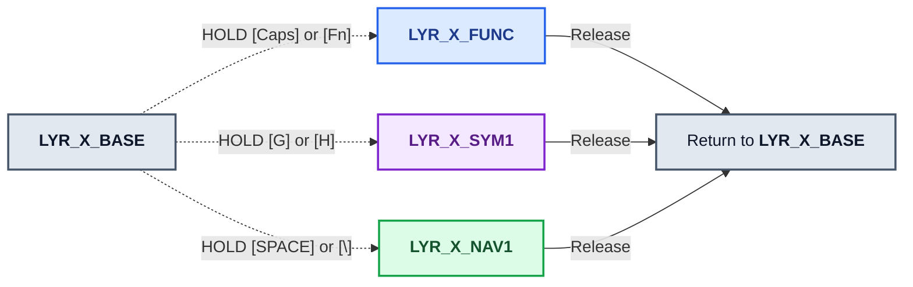
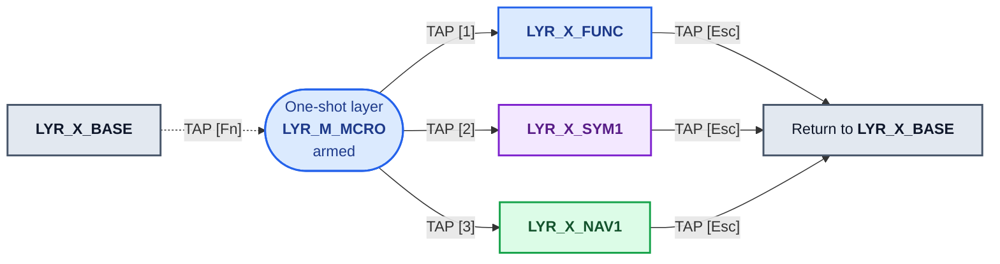

# Keychron B1 Pro (ANSI) ZMK Keymap Specification

This document defines the Keychron B1 Pro's intended ZMK keymap. The active
firmware source is `app/boards/shields/keychron/b1/us/keychron_b1_us.keymap`.
The diagrams are a specification: a binding is only implemented once it also
exists in that keymap and passes the focused validator.

## Canonical ZMK layer convention

ZMK addresses a layer by its **zero-based numeric index**. In a keymap,
`&mo`, `&lt`, and `&to` receive that index (or a C preprocessor constant that
expands to it). The devicetree node label, such as `layer_num`, is a
project-defined identifier, not a separate ZMK layer number.

Use these names and indices everywhere in this project:

| Index | Canonical constant | ZMK node     | Status                                          |
| ----: | ------------------ | ------------ | ----------------------------------------------- |
|     0 | `LYR_M_BASE`       | `LYR_M_BASE` | SWTICH TOGGLE MAC: Implemented default layer    |
|     1 | `LYR_M_FUNC`       | `LYR_M_FUNC` | Implemented factory Function layer & numpad     |
|     2 | `LYR_M_SYM1`       | `LYR_M_SYM1` | Implemented combined Symbols layer              |
|     3 | `LYR_M_NAV1`       | `LYR_M_NAV1` | Implemented Navigation layer                    |
|     4 | `LYR_M_UAT`        | `LYR_M_UAT`  | Reserved UAT layer; no Layer-0 entry point      |
|     5 | `LYR_M_MCRO`       | `LYR_M_MCRO` | Developer macro / Fn one-shot selector          |
|     6 | `LYR_W_BASE`       | `LYR_W_BASE` | Implemented minimal Win-switch base overlay     |
|     7 | `LYR_W_FUNC`       | `LYR_W_FUNC` | WIN: Functions, Layer switchers and Numpad      |
|     8 | `LYR_W_SYM1`       | `LYR_W_SYM1` | WIN: Symbols                                    |
|     9 | `LYR_W_NAV1`       | `LYR_W_NAV1` | WIN: Navigation                                 |
|    10 | `LYR_W_UAT`        | `LYR_W_UAT`  | RESERVED - CREATE BUT DO NOT USE                |
|    11 | `LYR_W_MCRO`       | `LYR_W_MCRO` | Reserved developer macro / Fn one-shot selector |

---

## Temporary Layer Access: User Workflow

This workflow enables the user to access the various layers while holding down a designated LAYER_ACTIVATION_KEY assigned to each layer. When the user releases the key, the keyboard will switch back to LYR_M_BASE. The LAYER_ACTIVATION_KEYS are:

|   LAYER Access | Temp Activation Keys    |
| -------------: | :---------------------- |
| **LYR_X_FUNC** | **[CAPS]** OR **[Fn]**  |
| **LYR_X_SYM1** | **[G]** OR **[H]**      |
| **LYR_X_NAV1** | **[SPACE]** or **[\\]** |



### Persistent Layer Access: User Workflow

1. The user will TAP the [Fn] key for One-Shot Access to LYR_X_MCRO
2. User taps the Number Row [1], [2], or [3]:
   a. [1] will switch to the LYR_X_FUNC.
   b. [2] will switch to the LYR_X_SYM1.
   c. [3] will switch to the LYR_X_NAV1.
3. From within the 3 layers (LYR_X_FUNC, LYR_X_SYM1, LYR_X_NAV1), the [Esc] is configured to switch the kayboard back to LYR_M_BASE.



---

## Layer Definitions (MAC)

### Layer Index 0: Base Layer `LYR_M_FUNC`

- **How Activated:** Default active layer when physical switch is set to **Mac**
- **Desired explicit dual-role definitions:**

  | Physical key | Tap action | Hold action                                                                   | VIA interpretation                                                      | Specification status                                 |
  | ------------ | ---------- | ----------------------------------------------------------------------------- | ----------------------------------------------------------------------- | ---------------------------------------------------- |
  | **[CAPS]**   | `Esc`      | Temporarily activate `LYR_M_FUNC`; releasing the key returns to `LYR_M_BASE`. | `LT(1, KC_ESC)`                                                         | Implemented in v0.23 candidate; hardware QC pending. |
  | **[Esc]**    | `Esc`      | After more than 600 ms, toggle `Caps Lock`.                                   | No direct VIA `LT` equivalent; requires a ZMK custom hold-tap behavior. | Implemented in v0.23 candidate; hardware QC pending. |

- **Special Dual-Role Keys:**
  - **Tab:** Taps as `Tab`, holds as **Hyper** (`Cmd + Alt + Ctrl + Shift`).
  - **Caps Lock:** Taps as `Escape`, holds **Layer 1 - Function and Numpad** (`LYR_M_FUNC`) only while held, then returns to `LYR_M_BASE` on release.
  - **Escape:** Taps as `Escape`; a hold longer than 600 ms toggles `Caps Lock`.
  - **Spacebar:** Taps as `Space`; hold temporarily activates `LYR_M_NAV1` in the v0.23 candidate.
  - **G** and **H:** Each taps as its letter and holds the shared **Layer 3 - Symbols** (`LYR_M_SYM1`).
  - **Z:** Currently sends plain `z`; it is not an Fn layer-tap.
  - **Physical Fn key:** Holds **Layer 1 - Function** (`LAYER_FN`).
  - **Home Row Modifiers:** Taps as character, holds as modifier on opposite-hand presses:
    - `A`/`S`/`D`/`F` $\rightarrow$ `Ctrl`/`Cmd`/`Alt`/`Shift`
    - `J`/`K`/`L`/`;` $\rightarrow$ `Shift`/`Alt`/`Cmd`/`Ctrl`

```text
    ┏━━━━━━━━━━━┳━━━━━━━━━┳━━━━━━━━━┳━━━━━━━━━┳━━━━━━━━━┳━━━━━━━━━┳━━━━━━━━━┳━━━━━━━━━┳━━━━━━━━━┳━━━━━━━━━┳━━━━━━━━━┳━━━━━━━━━┳━━━━━━━━━┳━━━━━━━━┓
    ┃           ┃         ┃         ┃         ┃         ┃         ┃         ┃         ┃         ┃         ┃         ┃         ┃         ┃        ┃
    ┃TAP: ESC   ┃   F1    ┃   F2    ┃   F3    ┃   F4    ┃   F5    ┃   F6    ┃    F7   ┃    F8   ┃    F9   ┃   F10   ┃   F11   ┃   F12   ┃  DEL   ┃
    ┃HOLD: CAPS ┃         ┃         ┃         ┃         ┃         ┃         ┃         ┃         ┃         ┃         ┃         ┃         ┃        ┃
    ┃           ┃         ┃         ┃         ┃         ┃         ┃         ┃         ┃         ┃         ┃         ┃         ┃         ┃        ┃
    ┣━━━━━━━┳━━━┻━━━━━┳━━━┻━━━━━┳━━━┻━━━━━┳━━━┻━━━━━┳━━━┻━━━━━┳━━━┻━━━━━┳━━━┻━━━━━┳━━━┻━━━━━┳━━━┻━━━━━┳━━━┻━━━━━┳━━━┻━━━━━┳━━━┻━━━━━┳━━━┻━━━━━━━━┫
    ┃   ~   ┃    !    ┃    @    ┃    #    ┃    $    ┃    %    ┃    ^    ┃    *    ┃    -    ┃    (    ┃    )    ┃    _    ┃    +    ┃            ┃
    ┃   `   ┃    1    ┃    2    ┃    3    ┃    4    ┃    5    ┃    6    ┃    7    ┃    8    ┃    9    ┃    0    ┃    -    ┃    =    ┃    BKSP    ┃
    ┃       ┃         ┃         ┃         ┃         ┃         ┃         ┃         ┃         ┃         ┃         ┃         ┃         ┃            ┃
    ┣━━━━━━━┻━━┳━━━━━━┻━━┳━━━━━━┻━━┳━━━━━━┻━━┳━━━━━━┻━━┳━━━━━━┻━━┳━━━━━━┻━━┳━━━━━━┻━━┳━━━━━━┻━━┳━━━━━━┻━━┳━━━━━━┻━━┳━━━━━━┻━━┳━━━━━━┻━━┳━━━━━━━━━┫
    ┃TAP: TAB  ┃         ┃         ┃         ┃         ┃         ┃         ┃         ┃         ┃         ┃         ┃    {    ┃    }    ┃    |    ┃
    ┃HOLD: HYPR┃    Q    ┃    W    ┃    E    ┃    R    ┃    T    ┃    Y    ┃    U    ┃    I    ┃    O    ┃    P    ┃    [    ┃    ]    ┃    \    ┃
    ┃          ┃         ┃         ┃         ┃         ┃         ┃         ┃         ┃         ┃         ┃         ┃         ┃         ┃         ┃
    ┣━━━━━━━━━━┻┳━━━━━━━━┻┳━━━━━━━━┻┳━━━━━━━━┻┳━━━━━━━━┻┳━━━━━━━━┻┳━━━━━━━━┻┳━━━━━━━━┻┳━━━━━━━━┻┳━━━━━━━━┻┳━━━━━━━━┻┳━━━━━━━━┻┳━━━━━━━━┻━━━━━━━━━┫
    ┃TAP=ESC    ┃ TAP=A   ┃ TAP=S   ┃ TAP=D   ┃ TAP=F   ┃ TAP=G   ┃ TAP=H   ┃ TAP=J   ┃ TAP=K   ┃ TAP=L   ┃ TAP=;/: ┃    "    ┃                  ┃
    ┃HOLD:MO(1) ┃ HLD=    ┃ HLD=    ┃ HLD=    ┃ HLD=    ┃ HLD=    ┃ HLD=    ┃ HLD=    ┃ HLD=    ┃ HLD=    ┃ HLD=    ┃    '    ┃      RETURN      ┃
    ┃           ┃  L_CTRL ┃  L_GUI  ┃  L_ALT  ┃ L_SHIFT ┃   MO(2) ┃   MO(2) ┃ R_SHIFT ┃  R_ALT  ┃  R_GUI  ┃  R_CTRL ┃         ┃                  ┃
    ┣━━━━━━━━━━━┻━━┳━━━━━━┻━━┳━━━━━━┻━━┳━━━━━━┻━━┳━━━━━━┻━━┳━━━━━━┻━━┳━━━━━━┻━━┳━━━━━━┻━━┳━━━━━━┻━━┳━━━━━━┻━━┳━━━━━━┻━━┳━━━━━━┻━━━━━━━━━━━━━━━━━━┫
    ┃              ┃         ┃         ┃         ┃         ┃         ┃         ┃         ┃    <    ┃    >    ┃    ?    ┃                         ┃
    ┃   L_SHIFT    ┃    Z    ┃    X    ┃    C    ┃    V    ┃    B    ┃   N     ┃    M    ┃    ,    ┃    .    ┃    /    ┃        R_SHIFT          ┃
    ┃              ┃         ┃         ┃         ┃         ┃         ┃         ┃         ┃         ┃         ┃         ┃                         ┃
    ┣━━━━━━━━━━━┳━━┻━━━━━━━┳━┻━━━━━━━━━╋━━━━━━━━━┻━━━━━━━━━┻━━━━━━━━━┻━━━━━━━━━┻━━━━━━━━━╋━━━━━━━━━┻━━━━┳━━━━┻━━━━━┳━┳━┻━━━━━━┳━━━━━━━━━┳━━━━━━━━┫
    ┃           ┃          ┃           ┃                                                 ┃              ┃TAP:OSL(5)┃ ┃        ┃    ↑    ┃        ┃
    ┃  L_CTRL   ┃  L_ALT   ┃   L_CMD   ┃             * &lt LYR_M_NAV1 SPACE *            ┃    R_CMD     ┃HOLD:MO(1)┃ ┃    ←   ┣━━━━━━━━━┫   →    ┃
    ┃           ┃          ┃           ┃                                                 ┃              ┃          ┃ ┃        ┃    ↓    ┃        ┃
    ┗━━━━━━━━━━━┻━━━━━━━━━━┻━━━━━━━━━━━┻━━━━━━━━━━━━━━━━━━━━━━━━━━━━━━━━━━━━━━━━━━━━━━━━━┻━━━━━━━━━━━━━━┻━━━━━━━━━━┛ ┗━━━━━━━━┻━━━━━━━━━┻━━━━━━━━┛

# MAC LAYER 0: LYR_M_BASE
    layer_m_base {
      bindings = <
        //ESC                     //f1          //f2          //f3        //f4          //f5              //f6              //f7          //f8          //f9          //f10            //f11       //f12                 //DEL
        &esc_caps CLCK ESC        &kp F1        &kp F2        &kp F3      &kp F4        &kp F5            &kp F6            &kp F7        &kp F8        &kp F9        &kp F10          &kp F11     &kp F12               &kp DEL
        &kp GRAVE                 &kp N1        &kp N2        &kp N3      &kp N4        &kp N5            &kp N6            &kp N7        &kp N8        &kp N9        &kp N0           &kp MINUS   &kp EQUAL             &kp BSPC
        &mt LC(LS(LG(LALT))) TAB  &kp Q         &kp W         &kp E       &kp R         &kp T             &kp Y             &kp U         &kp I         &kp O         &kp P            &kp LBKT    &kp RBKT              &lt LYR_M_NAV1 BSLH
        &lt LYR_M_FUNC ESC        &lhm LCTRL A  &lhm LGUI S   &lhm LALT D &lhm LSHFT F  &lt LYR_M_SYM1 G  &lt LYR_M_SYM1 H  &rhm RSHFT J  &rhm RALT K   &rhm RGUI L   &rhm RCTRL SEMI              &kp SQT               &kp RET
        &kp LSHFT                 &kp Z         &kp X         &kp C       &kp V         &kp B             &kp N             &kp M         &kp COMMA     &kp DOT       &kp FSLH         &kp RSHFT
        &kp LCTRL                 &uc LALT      &uc LCMD      &lt LYR_M_NAV1 SPACE      &uc RCMD          &fn_layer_access LYR_M_FUNC LYR_M_MCRO        &kp LEFT      &kp UP           &kp DOWN    &kp RIGHT
        &mo LYR_W_BASE            &out OUT_BLE  &out OUT_24G  &out OUT_CHG  &out OUT_CHGD
      >;
    };
```

### Layer Index 1: Functions and Numpad `LYR_M_FUNC`

- **How Activated:** Hold **Caps Lock** (taps as `Esc`).
- **Description:** Turns the top alpha row into a horizontal number line (`1` to `9`) and standard mathematical operators, with navigation and control keys on the right hand. Left hand home row contains Callum-style one-shot modifiers.
- **Brightness order:** `F1` decreases brightness; `F2` increases brightness.

- **Bluetooth profile controls - desired behavior:**

  | Key     | Tap                         | Double-tap                                       |
  | ------- | --------------------------- | ------------------------------------------------ |
  | **[Q]** | Select Bluetooth profile 1. | Start discovery/pairing for Bluetooth profile 1. |
  | **[W]** | Select Bluetooth profile 2. | Start discovery/pairing for Bluetooth profile 2. |
  | **[E]** | Select Bluetooth profile 3. | Start discovery/pairing for Bluetooth profile 3. |

  The double-tap pairing actions are a desired tap-dance behavior and require
  implementation and timing validation in the ZMK keymap.

```text
    ┏━━━━━━━━━━━┳━━━━━━━━━┳━━━━━━━━━┳━━━━━━━━━┳━━━━━━━━━┳━━━━━━━━━┳━━━━━━━━━┳━━━━━━━━━┳━━━━━━━━━┳━━━━━━━━━┳━━━━━━━━━┳━━━━━━━━━┳━━━━━━━━━┳━━━━━━━━┓
    ┃           ┃         ┃         ┃ MISSION ┃   MAC   ┃  SEARCH ┃ CTRL+ALT┃ PREVIOUS┃ PLAY/   ┃   NEXT  ┃   Vol   ┃         ┃         ┃        ┃
    ┃TO(LYR_M_  ┃ Bright- ┃ Bright+ ┃ CONTROL ┃ LAUNCH  ┃         ┃    + M  ┃  TRACK  ┃  PAUSE  ┃  TRACK  ┃   Mute  ┃   Vol-  ┃  Vol+   ┃   DEL  ┃
    ┃   BASE)   ┃         ┃         ┃         ┃         ┃         ┃         ┃         ┃         ┃         ┃         ┃         ┃         ┃        ┃
    ┣━━━━━━━┳━━━┻━━━━━┳━━━┻━━━━━┳━━━┻━━━━━┳━━━┻━━━━━┳━━━┻━━━━━┳━━━┻━━━━━┳━━━┻━━━━━┳━━━┻━━━━━┳━━━┻━━━━━┳━━━┻━━━━━┳━━━┻━━━━━┳━━━┻━━━━━┳━━━┻━━━━━━━━┫
    ┃       ┃TAP:BT1  ┃TAP:BT2  ┃TAP:BT3  ┃  2.4G   ┃         ┃         ┃ NUMPAD  ┃ NUMPAD  ┃ NUMPAD  ┃ NUMPAD  ┃         ┃         ┃            ┃
    ┃   ▼   ┃DBL:PAIR1┃DBL:PAIR2┃DBL:PAIR3┃  PAIR   ┃    ▼    ┃    ▼    ┃    ×    ┃    ÷    ┃    +    ┃    −    ┃   Boot  ┃  Search ┃     ▼      ┃
    ┃       ┃         ┃         ┃         ┃         ┃         ┃         ┃         ┃         ┃         ┃         ┃         ┃         ┃            ┃
    ┣━━━━━━━┻━━┳━━━━━━┻━━┳━━━━━━┻━━┳━━━━━━┻━━┳━━━━━━┻━━┳━━━━━━┻━━┳━━━━━━┻━━┳━━━━━━┻━━┳━━━━━━┻━━┳━━━━━━┻━━┳━━━━━━┻━━┳━━━━━━┻━━┳━━━━━━┻━━┳━━━━━━━━━┫
    ┃          ┃         ┃         ┃         ┃         ┃         ┃         ┃ NUMPAD  ┃ NUMPAD  ┃ NUMPAD  ┃         ┃         ┃         ┃ Screen  ┃
    ┃     ▼    ┃    ▼    ┃    ▼    ┃    ▼    ┃    ▼    ┃    ▼    ┃ DELETE  ┃    7    ┃    8    ┃    9    ┃BACKSPACE┃     ▼   ┃    ▼    ┃ Cap-Mac ┃
    ┃          ┃         ┃         ┃         ┃         ┃         ┃         ┃         ┃         ┃         ┃         ┃         ┃         ┃         ┃
    ┣━━━━━━━━━━┻┳━━━━━━━━┻┳━━━━━━━━┻┳━━━━━━━━┻┳━━━━━━━━┻┳━━━━━━━━┻┳━━━━━━━━┻┳━━━━━━━━┻┳━━━━━━━━┻┳━━━━━━━━┻┳━━━━━━━━┻┳━━━━━━━━┻┳━━━━━━━━┻━━━━━━━━━┫
    ┃           ┃         ┃         ┃         ┃         ┃         ┃ NUMPAD  ┃ NUMPAD  ┃ NUMPAD  ┃ NUMPAD  ┃         ┃         ┃                  ┃
    ┃   __▼__   ┃  L_CTRL ┃  L_GUI  ┃  L_ALT  ┃ L_SHIFT ┃     ▼   ┃   TAB   ┃    4    ┃    5    ┃    6    ┃  ENTER  ┃     ▼   ┃         ▼        ┃
    ┃           ┃         ┃         ┃         ┃         ┃         ┃         ┃         ┃         ┃         ┃         ┃         ┃                  ┃
    ┣━━━━━━━━━━━┻━━┳━━━━━━┻━━┳━━━━━━┻━━┳━━━━━━┻━━┳━━━━━━┻━━┳━━━━━━┻━━┳━━━━━━┻━━┳━━━━━━┻━━┳━━━━━━┻━━┳━━━━━━┻━━┳━━━━━━┻━━┳━━━━━━┻━━━━━━━━━━━━━━━━━━┫
    ┃              ┃         ┃         ┃         ┃         ┃         ┃         ┃ NUMPAD  ┃ NUMPAD  ┃ NUMPAD  ┃ NUMPAD  ┃                         ┃
    ┃       ▼      ┃     ▼   ┃     ▼   ┃     ▼   ┃    ▼    ┃    ▼    ┃    ,    ┃    1    ┃    2    ┃    3    ┃    .    ┃        Emoji-m          ┃
    ┃              ┃         ┃         ┃         ┃         ┃         ┃         ┃         ┃         ┃         ┃         ┃                         ┃
    ┣━━━━━━━━━━━┳━━┻━━━━━━━┳━┻━━━━━━━━━╋━━━━━━━━━┻━━━━━━━━━┻━━━━━━━━━┻━━━━━━━━━┻━━━━━━━━━╋━━━━━━━━━┻━━━━┳━━━━┻━━━━━┳━┳━┻━━━━━━┳━━━━━━━━━┳━━━━━━━━┫
    ┃           ┃          ┃           ┃                     NUMPAD                      ┃              ┃          ┃ ┃        ┃  PgUp   ┃        ┃
    ┃     ▼     ┃     ▼    ┃     ▼     ┃                        0                        ┃    R_CTRL    ┃     ▼    ┃ ┃  Home  ┣━━━━━━━━━┫   End  ┃
    ┃           ┃          ┃           ┃                                                 ┃              ┃          ┃ ┃        ┃  PgDn   ┃        ┃
    ┗━━━━━━━━━━━┻━━━━━━━━━━┻━━━━━━━━━━━┻━━━━━━━━━━━━━━━━━━━━━━━━━━━━━━━━━━━━━━━━━━━━━━━━━┻━━━━━━━━━━━━━━┻━━━━━━━━━━┛ ┗━━━━━━━━┻━━━━━━━━━┻━━━━━━━━┛

### MAC LAYER 1: LYR_M_FUNC
    layer_m_func {
      bindings = <
        //ESC           //F1                  //F2                  //F3                               //f4                  //f5              //f6            //f7            //f8              //f9          //f10         //f11                       //f12             //DEL
        &to LYR_M_BASE  &kp C_BRIGHTNESS_DEC  &kp C_BRIGHTNESS_INC  &kp C_AC_DESKTOP_SHOW_ALL_WINDOWS  &kp C_AC_MAC_LAUNCH   &kp C_AC_SEARCH   &uc LC(LA(M))  &kp C_PREVIOUS  &kp C_PLAY_PAUSE  &kp C_NEXT    &kp C_MUTE    &kp C_VOLUME_DOWN           &kp C_VOLUME_UP   &kp DEL
        &trans          &td_bt_0 0            &td_bt_1 0            &td_bt_2 0                         &out OUT_24G          &trans            &trans          &kp KP_MULTIPLY &kp KP_DIVIDE     &kp KP_PLUS   &kp KP_MINUS  &long_press_bootloader 0 0  &kp C_AC_SEARCH   &trans
        &trans          &trans                &trans                &trans                             &out OUT_24G          &trans            &kp DEL         &kp KP_N7       &kp KP_N8         &kp KP_N9     &kp BSPC      &trans                      &trans            &uc LG(LS(N4))
        &trans          &kp LCTRL             &kp LGUI              &kp LALT                           &kp LSHFT             &trans            &kp TAB         &kp KP_N4       &kp KP_N5         &kp KP_N6     &kp RET       &trans                                        &trans
        &trans          &trans                &trans                &trans                             &trans                &trans            &kp COMMA       &kp KP_N1       &kp KP_N2         &kp KP_N3     &kp KP_DOT    &uc LC(LG(SPACE))
        &trans          &trans                &trans                &kp KP_N0                          &kp RCTRL             &trans            &kp HOME        &kp PG_UP       &kp PG_DN         &kp END
        &none           &none                 &none                 &none                              &none
      >;
    };
```

---

### Layer Index 2: Symbols `LYR_M_SYM1`

- **How Activated:** Hold **`H`** (tapped as `h`), or Hold **`G`** (tapped as `g`).
- **Description:** Accesses easy-access symbols layer. Note that the

```text
    ┏━━━━━━━━━━━┳━━━━━━━━━┳━━━━━━━━━┳━━━━━━━━━┳━━━━━━━━━┳━━━━━━━━━┳━━━━━━━━━┳━━━━━━━━━┳━━━━━━━━━┳━━━━━━━━━┳━━━━━━━━━┳━━━━━━━━━┳━━━━━━━━━┳━━━━━━━━┓
    ┃           ┃         ┃         ┃         ┃         ┃         ┃         ┃         ┃         ┃         ┃         ┃         ┃         ┃        ┃
    ┃TO(LYR_M_  ┃   F13   ┃   F14   ┃   F15   ┃   F16   ┃   F17   ┃   F18   ┃   F19   ┃   F20   ┃   F21   ┃   F22   ┃   F23   ┃   F24   ┃   ▼    ┃
    ┃   BASE)   ┃         ┃         ┃         ┃         ┃         ┃         ┃         ┃         ┃         ┃         ┃         ┃         ┃        ┃
    ┣━━━━━━━┳━━━┻━━━━━┳━━━┻━━━━━┳━━━┻━━━━━┳━━━┻━━━━━┳━━━┻━━━━━┳━━━┻━━━━━┳━━━┻━━━━━┳━━━┻━━━━━┳━━━┻━━━━━┳━━━┻━━━━━┳━━━┻━━━━━┳━━━┻━━━━━┳━━━┻━━━━━━━━┫
    ┃       ┃         ┃         ┃         ┃         ┃         ┃         ┃         ┃         ┃         ┃         ┃         ┃         ┃            ┃
    ┃   ▼   ┃    ▼    ┃    ▼    ┃    ▼    ┃    ▼    ┃    ▼    ┃    ▼    ┃    ▼    ┃    ▼    ┃ LG(N0)  ┃LG(MINUS)┃LG(EQUAL)┃    ▼    ┃     ▼      ┃
    ┃       ┃         ┃         ┃         ┃         ┃         ┃         ┃         ┃         ┃         ┃         ┃         ┃         ┃            ┃
    ┣━━━━━━━┻━━┳━━━━━━┻━━┳━━━━━━┻━━┳━━━━━━┻━━┳━━━━━━┻━━┳━━━━━━┻━━┳━━━━━━┻━━┳━━━━━━┻━━┳━━━━━━┻━━┳━━━━━━┻━━┳━━━━━━┻━━┳━━━━━━┻━━┳━━━━━━┻━━┳━━━━━━━━━┫
    ┃          ┃         ┃         ┃         ┃         ┃         ┃         ┃         ┃         ┃ 1TAP: - ┃ 1TAP: = ┃         ┃         ┃         ┃
    ┃    [`]   ┃   [!]   ┃   [@]   ┃   [#]   ┃   [$]   ┃   [%]   ┃   [^]   ┃   [&]   ┃   [*]   ┃ 2TAP: _ ┃ 2TAP: + ┃    ▼    ┃    ▼    ┃    ▼    ┃
    ┃          ┃         ┃         ┃         ┃         ┃         ┃         ┃         ┃         ┃         ┃         ┃         ┃         ┃         ┃
    ┣━━━━━━━━━━┻┳━━━━━━━━┻┳━━━━━━━━┻┳━━━━━━━━┻┳━━━━━━━━┻┳━━━━━━━━┻┳━━━━━━━━┻┳━━━━━━━━┻┳━━━━━━━━┻┳━━━━━━━━┻┳━━━━━━━━┻┳━━━━━━━━┻┳━━━━━━━━┻━━━━━━━━━┫
    ┃           ┃         ┃         ┃         ┃         ┃    *    ┃   *     ┃ 1TAP: ( ┃ 1TAP: { ┃ 1TAP: [ ┃         ┃         ┃                  ┃
    ┃    [~]    ┃  L_CTRL ┃  L_GUI  ┃  L_ALT  ┃ L_SHIFT ┃  SYMBOL ┃ SYMBOL  ┃ 2TAP: ) ┃ 2TAP: } ┃ 2TAP: ] ┃    ▼    ┃    ▼    ┃       [=]        ┃
    ┃           ┃         ┃         ┃         ┃         ┃    *    ┃   *     ┃ 3TAP: ()┃ 3TAP: {}┃ 3TAP: []┃         ┃         ┃                  ┃
    ┣━━━━━━━━━━━┻━━┳━━━━━━┻━━┳━━━━━━┻━━┳━━━━━━┻━━┳━━━━━━┻━━┳━━━━━━┻━━┳━━━━━━┻━━┳━━━━━━┻━━┳━━━━━━┻━━┳━━━━━━┻━━┳━━━━━━┻━━┳━━━━━━┻━━━━━━━━━━━━━━━━━━┫
    ┃              ┃         ┃         ┃         ┃         ┃         ┃         ┃ 1TAP: < ┃         ┃         ┃         ┃                         ┃
    ┃       ▼      ┃         ┃         ┃         ┃         ┃         ┃         ┃ 2TAP: > ┃    ▼    ┃    ▼    ┃    ▼    ┃         Emoji-w         ┃
    ┃              ┃         ┃         ┃         ┃         ┃         ┃         ┃ 3TAP: <>┃         ┃         ┃         ┃                         ┃
    ┣━━━━━━━━━━━┳━━┻━━━━━━━┳━┻━━━━━━━━━╋━━━━━━━━━┻━━━━━━━━━┻━━━━━━━━━┻━━━━━━━━━┻━━━━━━━━━╋━━━━━━━━━┻━━━━┳━━━━┻━━━━━┳━┳━┻━━━━━━┳━━━━━━━━━┳━━━━━━━━┫
    ┃           ┃          ┃           ┃                                                 ┃              ┃          ┃ ┃        ┃    ↑    ┃        ┃
    ┃     ▼     ┃    ▼     ┃     ▼     ┃                         ▼                       ┃       ▼      ┃     ▼    ┃ ┃    ←   ┣━━━━━━━━━┫   →    ┃
    ┃           ┃          ┃           ┃                                                 ┃              ┃          ┃ ┃        ┃    ↓    ┃        ┃
    ┗━━━━━━━━━━━┻━━━━━━━━━━┻━━━━━━━━━━━┻━━━━━━━━━━━━━━━━━━━━━━━━━━━━━━━━━━━━━━━━━━━━━━━━━┻━━━━━━━━━━━━━━┻━━━━━━━━━━┛ ┗━━━━━━━━┻━━━━━━━━━┻━━━━━━━━┛

    layer_m_sym1 {
      bindings = <
        //ESC           //f1       //f2      //f3      //f4       //f5       //f6       //f7              //f8              //f9                 //f10          //f11          //f12          //DEL
        &to LYR_M_BASE  &kp F13    &kp F14   &kp F15   &kp F16    &kp F17    &kp F18    &kp F19           &kp F20           &kp F21              &kp F22        &kp F23        &kp F24        &trans
        &trans          &trans     &trans    &trans    &trans     &trans     &trans     &trans            &trans            &trans               &uc LG(N0)     &uc LG(MINUS)  &uc LG(EQUAL)  &trans
        // p28--p36: ` ! @ # $ % ^ & *; p37 O: tap - / double-tap _; p38 P: tap = / double-tap +; p39--p41 transparent.
        &kp GRAVE       &kp EXCL   &kp AT    &kp HASH  &kp DLLR   &kp PRCNT  &kp CARET  &kp AMPS          &kp ASTERISK      &td_sym_minus_underscore 0  &td_sym_equal_plus 0  &trans  &trans  &trans
        &kp TILDE       &kp LCTRL  &kp LGUI  &kp LALT  &kp LSHFT  &none      &none      &td_sym_parens 0  &td_sym_braces 0  &td_sym_brackets 0   &trans         &trans                        &kp EQUAL
        &trans          &none      &none     &none     &none      &none      &none      &none             &kp LT            &kp GT               &kp QMARK      &kp RSHFT
        &trans          &trans     &trans    &trans    &trans     &trans     &kp LEFT   &kp UP            &kp DOWN          &kp RIGHT
        &none           &none      &none     &none     &none
      >;
    };

```

---

### Layer Index 3: Navigation `LYR_M_NAV1`

> **Specification status:** Implemented in the v0.23 candidate. The diagram
> below is the required physical-position reference for this binding block.

- **Desired activation:** Hold **Spacebar** (tapped as `Space`).
- **Target description:** Re-map the right hand to navigation keys (Arrows,
  Home, End, Page Up, Page Down) and the left hand to standard modifiers sos––––––
  text can be navigated and selected without leaving the home row.

```text
    ┏━━━━━━━━━━━┳━━━━━━━━━┳━━━━━━━━━┳━━━━━━━━━┳━━━━━━━━━┳━━━━━━━━━┳━━━━━━━━━┳━━━━━━━━━┳━━━━━━━━━┳━━━━━━━━━┳━━━━━━━━━┳━━━━━━━━━┳━━━━━━━━━┳━━━━━━━━┓
    ┃           ┃         ┃         ┃         ┃         ┃         ┃         ┃         ┃         ┃         ┃         ┃         ┃         ┃        ┃
    ┃   TO(0)   ┃   F13   ┃   F14   ┃   F15   ┃   F16   ┃   F17   ┃   F18   ┃   F19   ┃   F20   ┃   F21   ┃   F22   ┃   F23   ┃   F24   ┃   ▼    ┃
    ┃           ┃         ┃         ┃         ┃         ┃         ┃         ┃         ┃         ┃         ┃         ┃         ┃         ┃        ┃
    ┣━━━━━━━┳━━━┻━━━━━┳━━━┻━━━━━┳━━━┻━━━━━┳━━━┻━━━━━┳━━━┻━━━━━┳━━━┻━━━━━┳━━━┻━━━━━┳━━━┻━━━━━┳━━━┻━━━━━┳━━━┻━━━━━┳━━━┻━━━━━┳━━━┻━━━━━┳━━━┻━━━━━━━━┫
    ┃       ┃         ┃         ┃         ┃         ┃         ┃         ┃         ┃         ┃         ┃         ┃         ┃         ┃            ┃
    ┃       ┃         ┃         ┃    #    ┃         ┃   MW ↓  ┃         ┃         ┃  SPACE  ┃         ┃  MBtn1  ┃ Mouse ↑ ┃  MBtn2  ┃            ┃
    ┃       ┃         ┃         ┃         ┃         ┃         ┃         ┃         ┃         ┃         ┃         ┃         ┃         ┃            ┃
    ┣━━━━━━━┻━━┳━━━━━━┻━━┳━━━━━━┻━━┳━━━━━━┻━━┳━━━━━━┻━━┳━━━━━━┻━━┳━━━━━━┻━━┳━━━━━━┻━━┳━━━━━━┻━━┳━━━━━━┻━━┳━━━━━━┻━━┳━━━━━━┻━━┳━━━━━━┻━━┳━━━━━━━━━┫
    ┃          ┃         ┃         ┃         ┃         ┃         ┃         ┃         ┃         ┃         ┃         ┃         ┃         ┃         ┃
    ┃          ┃  CMD Q  ┃ CTRL+W  ┃  MW ←   ┃  MW ↑   ┃  MW →   ┃  CMD+Y  ┃   Del   ┃    ↑    ┃  Bksp   ┃ Mouse ← ┃ Mouse ↓ ┃ Mouse → ┃         ┃
    ┃          ┃         ┃         ┃         ┃         ┃         ┃         ┃         ┃         ┃         ┃         ┃         ┃         ┃         ┃
    ┣━━━━━━━━━━┻┳━━━━━━━━┻┳━━━━━━━━┻┳━━━━━━━━┻┳━━━━━━━━┻┳━━━━━━━━┻┳━━━━━━━━┻┳━━━━━━━━┻┳━━━━━━━━┻┳━━━━━━━━┻┳━━━━━━━━┻┳━━━━━━━━┻┳━━━━━━━━┻━━━━━━━━━┫
    ┃           ┃         ┃         ┃         ┃         ┃         ┃         ┃         ┃         ┃         ┃         ┃         ┃                  ┃
    ┃           ┃   CTRL  ┃    GUI  ┃   Alt   ┃  Shift  ┃         ┃   Home  ┃    ←    ┃    ↓    ┃    →    ┃   End   ┃         ┃                  ┃
    ┃           ┃         ┃         ┃         ┃         ┃         ┃         ┃         ┃         ┃         ┃         ┃         ┃                  ┃
    ┣━━━━━━━━━━━┻━━┳━━━━━━┻━━┳━━━━━━┻━━┳━━━━━━┻━━┳━━━━━━┻━━┳━━━━━━┻━━┳━━━━━━┻━━┳━━━━━━┻━━┳━━━━━━┻━━┳━━━━━━┻━━┳━━━━━━┻━━┳━━━━━━┻━━━━━━━━━━━━━━━━━━┫
    ┃              ┃         ┃         ┃         ┃         ┃         ┃         ┃         ┃   CTRL  ┃  CTRL   ┃   CMD   ┃                         ┃
    ┃              ┃  CMD Z  ┃  CMD X  ┃  CMD C  ┃  CMD V  ┃  CMD B  ┃  PgUp   ┃  PgDn   ┃  SHIFT  ┃   TAB   ┃  SHIFT  ┃                         ┃
    ┃              ┃         ┃         ┃         ┃         ┃         ┃         ┃         ┃    TAB  ┃         ┃    /    ┃                         ┃
    ┣━━━━━━━━━━━┳━━┻━━━━━━━┳━┻━━━━━━━━━╋━━━━━━━━━┻━━━━━━━━━┻━━━━━━━━━┻━━━━━━━━━┻━━━━━━━━━╋━━━━━━━━━┻━━━━┳━━━━┻━━━━━┳━┳━┻━━━━━━┳━━━━━━━━━┳━━━━━━━━┫
    ┃           ┃          ┃           ┃                                                 ┃              ┃          ┃ ┃        ┃    ↑    ┃        ┃
    ┃   MSPD1   ┃   MSPD2  ┃   MSPD3   ┃                                                 ┃              ┃          ┃ ┃    ←   ┣━━━━━━━━━┫   →    ┃
    ┃           ┃          ┃           ┃                                                 ┃              ┃          ┃ ┃        ┃    ↓    ┃        ┃
    ┗━━━━━━━━━━━┻━━━━━━━━━━┻━━━━━━━━━━━┻━━━━━━━━━━━━━━━━━━━━━━━━━━━━━━━━━━━━━━━━━━━━━━━━━┻━━━━━━━━━━━━━━┻━━━━━━━━━━┛ ┗━━━━━━━━┻━━━━━━━━━┻━━━━━━━━┛

    layer_m_nav1 {
      bindings = <
        //ESC             //f1              //f2              //f3                  //f4                  //f5                  //f6        //f7        //f8             //f9             //f10               //f11           //f12               //DEL
        &to LYR_M_BASE    &kp F13           &kp F14           &kp F15               &kp F16               &kp F17               &kp F18     &kp F19     &kp F20          &kp F21          &kp F22             &kp F23         &kp F24             &trans
        // p14--p27: `, 1--0, -, =, Bspc; p22 (physical 8) sends Space on NAV1.
        &none             &none             &none             &kp HASH              &none                 &uc MOUSE_WHEEL_DOWN  &none       &none       &kp SPACE        &none            &uc MOUSE_BUTTON_1  &uc MOUSE_UP    &uc MOUSE_BUTTON_2  &none
        &none             &uc LG(Q)         &uc LC(W)         &uc MOUSE_WHEEL_LEFT  &uc MOUSE_WHEEL_UP    &uc MOUSE_WHEEL_RIGHT &uc LG(Y)   &kp DEL     &kp UP           &kp BSPC         &uc MOUSE_LEFT      &uc MOUSE_DOWN  &uc MOUSE_RIGHT     &none
        &none             &kp LCTRL         &kp LGUI          &kp LALT              &kp LSHFT             &none                 &kp HOME    &kp LEFT    &kp DOWN         &kp RIGHT        &kp END             &none           &none
        &none             &uc LG(Z)         &uc LG(X)         &uc LG(C)             &uc LG(V)             &uc LG(B)             &kp PG_UP   &kp PG_DN   &uc LC(LS(TAB))  &uc LC(TAB)      &uc LG(LS(FSLH))    &none
        &uc MOUSE_SPEED_1 &uc MOUSE_SPEED_2 &uc MOUSE_SPEED_3                       &none                                       &none       &none       &kp LEFT         &kp UP           &kp DOWN            &kp RIGHT
        &none             &none             &none             &none                 &none
    >;
    };

```

---

### Layer 4: LYR_M_UAT

- **How Activated:** Function-layer `4`.
- **Description:** Reserved UAT layer. Escape returns to Layer 0; every other
  position is inert.

```text
    ┏━━━━━━━━━━━┳━━━━━━━━━┳━━━━━━━━━┳━━━━━━━━━┳━━━━━━━━━┳━━━━━━━━━┳━━━━━━━━━┳━━━━━━━━━┳━━━━━━━━━┳━━━━━━━━━┳━━━━━━━━━┳━━━━━━━━━┳━━━━━━━━━┳━━━━━━━━┓
    ┃           ┃         ┃         ┃         ┃         ┃         ┃         ┃         ┃         ┃         ┃         ┃         ┃         ┃        ┃
    ┃   TO(0)   ┃         ┃         ┃         ┃         ┃         ┃         ┃         ┃         ┃         ┃         ┃         ┃         ┃        ┃
    ┃           ┃         ┃         ┃         ┃         ┃         ┃         ┃         ┃         ┃         ┃         ┃         ┃         ┃        ┃
    ┣━━━━━━━┳━━━┻━━━━━┳━━━┻━━━━━┳━━━┻━━━━━┳━━━┻━━━━━┳━━━┻━━━━━┳━━━┻━━━━━┳━━━┻━━━━━┳━━━┻━━━━━┳━━━┻━━━━━┳━━━┻━━━━━┳━━━┻━━━━━┳━━━┻━━━━━┳━━━┻━━━━━━━━┫
    ┃       ┃         ┃         ┃         ┃         ┃         ┃         ┃         ┃         ┃         ┃         ┃         ┃         ┃            ┃
    ┃       ┃         ┃         ┃         ┃         ┃         ┃         ┃         ┃         ┃         ┃         ┃         ┃         ┃            ┃
    ┃       ┃         ┃         ┃         ┃         ┃         ┃         ┃         ┃         ┃         ┃         ┃         ┃         ┃            ┃
    ┣━━━━━━━┻━━┳━━━━━━┻━━┳━━━━━━┻━━┳━━━━━━┻━━┳━━━━━━┻━━┳━━━━━━┻━━┳━━━━━━┻━━┳━━━━━━┻━━┳━━━━━━┻━━┳━━━━━━┻━━┳━━━━━━┻━━┳━━━━━━┻━━┳━━━━━━┻━━┳━━━━━━━━━┫
    ┃          ┃         ┃         ┃         ┃         ┃         ┃         ┃         ┃         ┃         ┃         ┃         ┃         ┃         ┃
    ┃          ┃         ┃         ┃         ┃         ┃         ┃         ┃         ┃         ┃         ┃         ┃         ┃         ┃         ┃
    ┃          ┃         ┃         ┃         ┃         ┃         ┃         ┃         ┃         ┃         ┃         ┃         ┃         ┃         ┃
    ┣━━━━━━━━━━┻┳━━━━━━━━┻┳━━━━━━━━┻┳━━━━━━━━┻┳━━━━━━━━┻┳━━━━━━━━┻┳━━━━━━━━┻┳━━━━━━━━┻┳━━━━━━━━┻┳━━━━━━━━┻┳━━━━━━━━┻┳━━━━━━━━┻┳━━━━━━━━┻━━━━━━━━━┫
    ┃           ┃         ┃         ┃         ┃         ┃         ┃         ┃         ┃         ┃         ┃         ┃         ┃                  ┃
    ┃           ┃         ┃         ┃         ┃         ┃         ┃         ┃         ┃         ┃         ┃         ┃         ┃                  ┃
    ┃           ┃         ┃         ┃         ┃         ┃         ┃         ┃         ┃         ┃         ┃         ┃         ┃                  ┃
    ┣━━━━━━━━━━━┻━━┳━━━━━━┻━━┳━━━━━━┻━━┳━━━━━━┻━━┳━━━━━━┻━━┳━━━━━━┻━━┳━━━━━━┻━━┳━━━━━━┻━━┳━━━━━━┻━━┳━━━━━━┻━━┳━━━━━━┻━━┳━━━━━━┻━━━━━━━━━━━━━━━━━━┫
    ┃              ┃         ┃         ┃         ┃         ┃         ┃         ┃         ┃         ┃         ┃         ┃                         ┃
    ┃              ┃         ┃         ┃         ┃         ┃         ┃         ┃         ┃         ┃         ┃         ┃                         ┃
    ┃              ┃         ┃         ┃         ┃         ┃         ┃         ┃         ┃         ┃         ┃         ┃                         ┃
    ┣━━━━━━━━━━━┳━━┻━━━━━━━┳━┻━━━━━━━━━╋━━━━━━━━━┻━━━━━━━━━┻━━━━━━━━━┻━━━━━━━━━┻━━━━━━━━━╋━━━━━━━━━┻━━━━┳━━━━┻━━━━━┳━┳━┻━━━━━━┳━━━━━━━━━┳━━━━━━━━┫
    ┃           ┃          ┃           ┃                                                 ┃              ┃          ┃ ┃        ┃         ┃        ┃
    ┃           ┃          ┃           ┃                                                 ┃              ┃          ┃ ┃        ┣━━━━━━━━━┫        ┃
    ┃           ┃          ┃           ┃                                                 ┃              ┃          ┃ ┃        ┃         ┃        ┃
    ┗━━━━━━━━━━━┻━━━━━━━━━━┻━━━━━━━━━━━┻━━━━━━━━━━━━━━━━━━━━━━━━━━━━━━━━━━━━━━━━━━━━━━━━━┻━━━━━━━━━━━━━━┻━━━━━━━━━━┛ ┗━━━━━━━━┻━━━━━━━━━┻━━━━━━━━┛

// Layer 4 (LYR_M_UAT): Escape exits; direct controls remain inert.
    layer_m_uat {
      bindings = <
        //ESC           //f1    //f2    //f3    //f4    //f5    //f6    //f7    //f8    //f9    //f10   //f11   //f12   //DEL
        &to LYR_M_BASE  &none   &none   &none   &none   &none   &none   &none   &none   &none   &none   &none   &none   &none
        &none           &none   &none   &none   &none   &none   &none   &none   &none   &none   &none   &none   &none   &none
        &none           &none   &none   &none   &none   &none   &none   &none   &none   &none   &none   &none   &none   &none
        &none           &none   &none   &none   &none   &none   &none   &none   &none   &none   &none   &none   &none
        &none           &none   &none   &none   &none   &none   &none   &none   &none   &none   &none   &none
        &none           &none   &none   &none   &none   &none   &none   &none   &none   &none
        &none           &none   &none   &none   &none
      >;
    };


```

### Layer 5: LYR_M_MCRO

- **How Activated:** From LYR_M_BASE, tap the Fn key to activates this layer (LYR_M_MCRO) for a single key-press, i.e. a One-Shot Layer (OSL).
- **Description:** Reserved UAT layer. Escape returns to Layer 0; every other position is inert.
- **Persistent layer selection:** The number-row [1], [2], [3] and [4] keys use `TO(X)` to select `LYR_M_FUNC`, `LYR_M_SYM1`, `LYR_M_NAV1`, or `LYR_M_UAT`

```text
    ┏━━━━━━━━━━━┳━━━━━━━━━┳━━━━━━━━━┳━━━━━━━━━┳━━━━━━━━━┳━━━━━━━━━┳━━━━━━━━━┳━━━━━━━━━┳━━━━━━━━━┳━━━━━━━━━┳━━━━━━━━━┳━━━━━━━━━┳━━━━━━━━━┳━━━━━━━━┓
    ┃           ┃         ┃         ┃         ┃         ┃         ┃         ┃         ┃         ┃         ┃         ┃         ┃         ┃        ┃
    ┃TO(LYR_M_  ┃         ┃         ┃         ┃         ┃         ┃         ┃         ┃         ┃         ┃         ┃         ┃         ┃        ┃
    ┃   BASE)   ┃         ┃         ┃         ┃         ┃         ┃         ┃         ┃         ┃         ┃         ┃         ┃         ┃        ┃
    ┣━━━━━━━┳━━━┻━━━━━┳━━━┻━━━━━┳━━━┻━━━━━┳━━━┻━━━━━┳━━━┻━━━━━┳━━━┻━━━━━┳━━━┻━━━━━┳━━━┻━━━━━┳━━━┻━━━━━┳━━━┻━━━━━┳━━━┻━━━━━┳━━━┻━━━━━┳━━━┻━━━━━━━━┫
    ┃       ┃         ┃         ┃         ┃         ┃         ┃         ┃         ┃         ┃         ┃         ┃         ┃         ┃            ┃
    ┃       ┃TO(LYR_M_┃TO(LYR_M_┃TO(LYR_M_┃TO(LYR_M_┃         ┃         ┃         ┃         ┃         ┃         ┃         ┃         ┃            ┃
    ┃       ┃   FUNC) ┃   SYM1) ┃   NAV1) ┃   UAT)  ┃         ┃         ┃         ┃         ┃         ┃         ┃         ┃         ┃            ┃
    ┣━━━━━━━┻━━┳━━━━━━┻━━┳━━━━━━┻━━┳━━━━━━┻━━┳━━━━━━┻━━┳━━━━━━┻━━┳━━━━━━┻━━┳━━━━━━┻━━┳━━━━━━┻━━┳━━━━━━┻━━┳━━━━━━┻━━┳━━━━━━┻━━┳━━━━━━┻━━┳━━━━━━━━━┫
    ┃          ┃         ┃         ┃         ┃         ┃         ┃         ┃         ┃         ┃         ┃         ┃         ┃         ┃         ┃
    ┃          ┃         ┃         ┃         ┃         ┃         ┃         ┃         ┃         ┃         ┃         ┃         ┃         ┃         ┃
    ┃          ┃         ┃         ┃         ┃         ┃         ┃         ┃         ┃         ┃         ┃         ┃         ┃         ┃         ┃
    ┣━━━━━━━━━━┻┳━━━━━━━━┻┳━━━━━━━━┻┳━━━━━━━━┻┳━━━━━━━━┻┳━━━━━━━━┻┳━━━━━━━━┻┳━━━━━━━━┻┳━━━━━━━━┻┳━━━━━━━━┻┳━━━━━━━━┻┳━━━━━━━━┻┳━━━━━━━━┻━━━━━━━━━┫
    ┃           ┃         ┃         ┃         ┃         ┃         ┃         ┃         ┃         ┃         ┃         ┃         ┃                  ┃
    ┃           ┃         ┃         ┃         ┃         ┃         ┃         ┃         ┃         ┃         ┃         ┃         ┃                  ┃
    ┃           ┃         ┃         ┃         ┃         ┃         ┃         ┃         ┃         ┃         ┃         ┃         ┃                  ┃
    ┣━━━━━━━━━━━┻━━┳━━━━━━┻━━┳━━━━━━┻━━┳━━━━━━┻━━┳━━━━━━┻━━┳━━━━━━┻━━┳━━━━━━┻━━┳━━━━━━┻━━┳━━━━━━┻━━┳━━━━━━┻━━┳━━━━━━┻━━┳━━━━━━┻━━━━━━━━━━━━━━━━━━┫
    ┃              ┃         ┃         ┃         ┃         ┃         ┃         ┃         ┃         ┃         ┃         ┃                         ┃
    ┃              ┃         ┃         ┃         ┃         ┃         ┃         ┃         ┃         ┃         ┃         ┃                         ┃
    ┃              ┃         ┃         ┃         ┃         ┃         ┃         ┃         ┃         ┃         ┃         ┃                         ┃
    ┣━━━━━━━━━━━┳━━┻━━━━━━━┳━┻━━━━━━━━━╋━━━━━━━━━┻━━━━━━━━━┻━━━━━━━━━┻━━━━━━━━━┻━━━━━━━━━╋━━━━━━━━━┻━━━━┳━━━━┻━━━━━┳━┳━┻━━━━━━┳━━━━━━━━━┳━━━━━━━━┫
    ┃           ┃          ┃           ┃                                                 ┃              ┃          ┃ ┃        ┃         ┃        ┃
    ┃           ┃          ┃           ┃                                                 ┃              ┃          ┃ ┃        ┣━━━━━━━━━┫        ┃
    ┃           ┃          ┃           ┃                                                 ┃              ┃          ┃ ┃        ┃         ┃        ┃
    ┗━━━━━━━━━━━┻━━━━━━━━━━┻━━━━━━━━━━━┻━━━━━━━━━━━━━━━━━━━━━━━━━━━━━━━━━━━━━━━━━━━━━━━━━┻━━━━━━━━━━━━━━┻━━━━━━━━━━┛ ┗━━━━━━━━┻━━━━━━━━━┻━━━━━━━━┛

// Layer 5 (LYR_M_MCRO): Fn tap opens this one-shot selector. N1--N4 select
// persistent Layers 1--4; Esc returns to Layer 0; every other position is inert.
    layer_m_mcro {
      bindings = <
        //ESC           //f1            //f2            //f3            //f4            //f5    //f6    //f7    //f8    //f9    //f10   //f11   //f12   //DEL
        &to LYR_M_BASE  &none           &none           &none           &none           &none   &none   &none   &none   &none   &none   &none   &none   &none
        &none           &to LYR_M_FUNC  &to LYR_M_SYM1  &to LYR_M_NAV1  &to LYR_M_UAT   &none   &none   &none   &none   &none   &none   &none   &none   &none
        &none           &none           &none           &none           &none           &none   &none   &none   &none   &none   &none   &none   &none   &none
        &none           &none           &none           &none           &none           &none   &none   &none   &none   &none   &none   &none   &none
        &none           &none           &none           &none           &none           &none   &none   &none   &none   &none   &none   &none
        &none           &none           &none                           &none           &none   &none   &none   &none   &none   &none
        &none           &none           &none           &none           &none
      >;
    };
```

--

# Windows Layers

## Layer Index 6: [Windows/Linux] Base Layer `LYR_W_BASE`

- **How Activated:** The Layer 0 physical Win-switch binding is
  `&mo LYR_W_BASE` at position 77.
- **Current scope:** Mirrors the 0--76 typing and layer-access map of
  `LYR_M_BASE`; the Windows-specific Layers 7--11 are specified below.
  Positions 77--81 are inert on this overlay.
- **Desired explicit dual-role definitions:**

  | Physical key | Tap action | Hold action                                                                   | VIA interpretation                                                      | Specification status                                 |
  | ------------ | ---------- | ----------------------------------------------------------------------------- | ----------------------------------------------------------------------- | ---------------------------------------------------- |
  | **[CAPS]**   | `Esc`      | Temporarily activate `LYR_W_FUNC`; releasing the key returns to `LYR_W_BASE`. | `LT(LYR_W_FUNC, KC_ESC)`                                                | Implemented in v0.23 candidate; hardware QC pending. |
  | **[Esc]**    | `Esc`      | After more than 600 ms, toggle `Caps Lock`.                                   | No direct VIA `LT` equivalent; requires a ZMK custom hold-tap behavior. | Implemented in v0.23 candidate; hardware QC pending. |

- **Special Dual-Role Keys:**
  - **Tab:** Taps as `Tab`, holds as **Hyper** (`Win + Alt + Ctrl + Shift`).
  - **Caps Lock:** Taps as `Escape`, holds **Layer 1 - Function and Numpad** (`LYR_W_FUNC`) only while held, then returns to `LYR_W_BASE` on release.
  - **Escape:** Taps as `Escape`; a hold longer than 600 ms toggles `Caps Lock`.
  - **Spacebar:** Taps as `Space`; hold temporarily activates `LYR_W_NAV1` in the v0.23 candidate.
  - **G** and **H:** Each taps as its letter and holds the shared **Layer 3 - Symbols** (`LYR_W_SYM1`).
  - **Z:** Currently sends plain `z`; it is not an Fn layer-tap.
  - **Physical Fn key:** Holds **Layer 1 - Function** (`LAYER_FN`).
  - **Home Row Modifiers:** Taps as character, holds as modifier on opposite-hand presses:
    - `A`/`S`/`D`/`F` $\rightarrow$ `Ctrl`/`Win`/`Alt`/`Shift`
    - `J`/`K`/`L`/`;` $\rightarrow$ `Shift`/`Alt`/`Win`/`Ctrl`

```text
    ┏━━━━━━━━━━━┳━━━━━━━━━┳━━━━━━━━━┳━━━━━━━━━┳━━━━━━━━━┳━━━━━━━━━┳━━━━━━━━━┳━━━━━━━━━┳━━━━━━━━━┳━━━━━━━━━┳━━━━━━━━━┳━━━━━━━━━┳━━━━━━━━━┳━━━━━━━━┓
    ┃           ┃         ┃         ┃         ┃         ┃         ┃         ┃         ┃         ┃         ┃         ┃         ┃         ┃        ┃
    ┃TAP: ESC   ┃   F1    ┃   F2    ┃   F3    ┃   F4    ┃   F5    ┃   F6    ┃    F7   ┃    F8   ┃    F9   ┃   F10   ┃   F11   ┃   F12   ┃  DEL   ┃
    ┃HOLD: CAPS ┃         ┃         ┃         ┃         ┃         ┃         ┃         ┃         ┃         ┃         ┃         ┃         ┃        ┃
    ┃           ┃         ┃         ┃         ┃         ┃         ┃         ┃         ┃         ┃         ┃         ┃         ┃         ┃        ┃
    ┣━━━━━━━┳━━━┻━━━━━┳━━━┻━━━━━┳━━━┻━━━━━┳━━━┻━━━━━┳━━━┻━━━━━┳━━━┻━━━━━┳━━━┻━━━━━┳━━━┻━━━━━┳━━━┻━━━━━┳━━━┻━━━━━┳━━━┻━━━━━┳━━━┻━━━━━┳━━━┻━━━━━━━━┫
    ┃   ~   ┃    !    ┃    @    ┃    #    ┃    $    ┃    %    ┃    ^    ┃    *    ┃    -    ┃    (    ┃    )    ┃    _    ┃    +    ┃            ┃
    ┃   `   ┃    1    ┃    2    ┃    3    ┃    4    ┃    5    ┃    6    ┃    7    ┃    8    ┃    9    ┃    0    ┃    -    ┃    =    ┃    BKSP    ┃
    ┃       ┃         ┃         ┃         ┃         ┃         ┃         ┃         ┃         ┃         ┃         ┃         ┃         ┃            ┃
    ┣━━━━━━━┻━━┳━━━━━━┻━━┳━━━━━━┻━━┳━━━━━━┻━━┳━━━━━━┻━━┳━━━━━━┻━━┳━━━━━━┻━━┳━━━━━━┻━━┳━━━━━━┻━━┳━━━━━━┻━━┳━━━━━━┻━━┳━━━━━━┻━━┳━━━━━━┻━━┳━━━━━━━━━┫
    ┃TAP: TAB  ┃         ┃         ┃         ┃         ┃         ┃         ┃         ┃         ┃         ┃         ┃    {    ┃    }    ┃    |    ┃
    ┃HOLD: HYPR┃    Q    ┃    W    ┃    E    ┃    R    ┃    T    ┃    Y    ┃    U    ┃    I    ┃    O    ┃    P    ┃    [    ┃    ]    ┃    \    ┃
    ┃          ┃         ┃         ┃         ┃         ┃         ┃         ┃         ┃         ┃         ┃         ┃         ┃         ┃         ┃
    ┣━━━━━━━━━━┻┳━━━━━━━━┻┳━━━━━━━━┻┳━━━━━━━━┻┳━━━━━━━━┻┳━━━━━━━━┻┳━━━━━━━━┻┳━━━━━━━━┻┳━━━━━━━━┻┳━━━━━━━━┻┳━━━━━━━━┻┳━━━━━━━━┻┳━━━━━━━━┻━━━━━━━━━┫
    ┃TAP=ESC    ┃ TAP=A   ┃ TAP=S   ┃ TAP=D   ┃ TAP=F   ┃ TAP=G   ┃ TAP=H   ┃ TAP=J   ┃ TAP=K   ┃ TAP=L   ┃ TAP=;/: ┃    "    ┃                  ┃
    ┃HOLD:MO(7) ┃ HLD=    ┃ HLD=    ┃ HLD=    ┃ HLD=    ┃ HLD=    ┃ HLD=    ┃ HLD=    ┃ HLD=    ┃ HLD=    ┃ HLD=    ┃    '    ┃      RETURN      ┃
    ┃           ┃  L_CTRL ┃  L_GUI  ┃  L_ALT  ┃ L_SHIFT ┃   MO(2) ┃   MO(2) ┃ R_SHIFT ┃  R_ALT  ┃  R_GUI  ┃  R_CTRL ┃         ┃                  ┃
    ┣━━━━━━━━━━━┻━━┳━━━━━━┻━━┳━━━━━━┻━━┳━━━━━━┻━━┳━━━━━━┻━━┳━━━━━━┻━━┳━━━━━━┻━━┳━━━━━━┻━━┳━━━━━━┻━━┳━━━━━━┻━━┳━━━━━━┻━━┳━━━━━━┻━━━━━━━━━━━━━━━━━━┫
    ┃              ┃         ┃         ┃         ┃         ┃         ┃         ┃         ┃    <    ┃    >    ┃    ?    ┃                         ┃
    ┃   L_SHIFT    ┃    Z    ┃    X    ┃    C    ┃    V    ┃    B    ┃   N     ┃    M    ┃    ,    ┃    .    ┃    /    ┃        R_SHIFT          ┃
    ┃              ┃         ┃         ┃         ┃         ┃         ┃         ┃         ┃         ┃         ┃         ┃                         ┃
    ┣━━━━━━━━━━━┳━━┻━━━━━━━┳━┻━━━━━━━━━╋━━━━━━━━━┻━━━━━━━━━┻━━━━━━━━━┻━━━━━━━━━┻━━━━━━━━━╋━━━━━━━━━┻━━━━┳━━━━┻━━━━━┳━┳━┻━━━━━━┳━━━━━━━━━┳━━━━━━━━┫
    ┃           ┃          ┃           ┃                                                 ┃              ┃TAP: OSL( ┃ ┃        ┃    ↑    ┃        ┃
    ┃  L_CTRL   ┃  L_GUI   ┃   L_ALT   ┃             * &lt LYR_W_NAV1 SPACE *            ┃    R_ALT     ┃    11)   ┃ ┃    ←   ┣━━━━━━━━━┫   →    ┃
    ┃           ┃          ┃           ┃                                                 ┃              ┃HOLD:MO(7)┃ ┃        ┃    ↓    ┃        ┃
    ┗━━━━━━━━━━━┻━━━━━━━━━━┻━━━━━━━━━━━┻━━━━━━━━━━━━━━━━━━━━━━━━━━━━━━━━━━━━━━━━━━━━━━━━━┻━━━━━━━━━━━━━━┻━━━━━━━━━━┛ ┗━━━━━━━━┻━━━━━━━━━┻━━━━━━━━┛

### Layer Index 6: Windows Base `LYR_W_BASE`

> This binding block implements the Windows Base illustration above. Its Fn
> behavior is `TAP:OSL(11)` and `HOLD:MO(7)` through
> `&fn_layer_access LYR_W_FUNC LYR_W_MCRO`.
    layer_w_base {
      bindings = <
        //ESC                     //f1          //f2         //f3                  //f4          //f5              //f6              //f7          //f8          //f9         //f10            //f11      //f12      //DEL
        &esc_caps CLCK ESC        &kp F1        &kp F2       &kp F3                &kp F4        &kp F5            &kp F6            &kp F7        &kp F8        &kp F9       &kp F10          &kp F11    &kp F12    &kp DEL
        &kp GRAVE                 &kp N1        &kp N2       &kp N3                &kp N4        &kp N5            &kp N6            &kp N7        &kp N8        &kp N9       &kp N0           &kp MINUS  &kp EQUAL  &kp BSPC
        &mt LC(LS(LG(LALT))) TAB  &kp Q         &kp W        &kp E                 &kp R         &kp T             &kp Y             &kp U         &kp I         &kp O        &kp P            &kp LBKT   &kp RBKT   &lt LYR_W_NAV1 BSLH
        &lt LYR_W_FUNC ESC        &lhm LCTRL A  &lhm LGUI S  &lhm LALT D           &lhm LSHFT F  &lt LYR_W_SYM1 G  &lt LYR_W_SYM1 H  &rhm RSHFT J  &rhm RALT K   &rhm RGUI L  &rhm RCTRL SEMI  &kp SQT               &kp RET
        &kp LSHFT                 &kp Z         &kp X        &kp C                 &kp V         &kp B             &kp N             &kp M         &kp COMMA     &kp DOT      &kp FSLH         &kp RSHFT
        &kp LCTRL                 &uc LALT      &uc LCMD     &lt LYR_W_NAV1 SPACE  &uc RCMD      &fn_layer_access LYR_W_FUNC LYR_W_MCRO            &kp LEFT      &kp UP       &kp DOWN         &kp RIGHT
        &none                     &none         &none                     &none                              &none
      >;
    };
```

### Layer Index 7: Functions and Numpad `LYR_W_FUNC`

- **How Activated:** Hold **Caps Lock** (taps as `Esc`).
- **Description:** Turns the top alpha row into a horizontal number line (`1` to `9`) and standard mathematical operators, with navigation and control keys on the right hand. Left hand home row contains Callum-style one-shot modifiers.
- **Brightness order:** `F1` decreases brightness; `F2` increases brightness.
- **Persistent layer selection:** The number-row **[1]**, **[2]**, and **[3]** keys use `TO(1)`, `TO(2)`, and `TO(3)` respectively to select `LYR_W_FUNC`, `LYR_W_SYM1`, or `LYR_W_NAV1`.
- **Bluetooth profile controls - desired behavior:**

  | Key     | Tap                         | Double-tap                                       |
  | ------- | --------------------------- | ------------------------------------------------ |
  | **[Q]** | Select Bluetooth profile 1. | Start discovery/pairing for Bluetooth profile 1. |
  | **[W]** | Select Bluetooth profile 2. | Start discovery/pairing for Bluetooth profile 2. |
  | **[E]** | Select Bluetooth profile 3. | Start discovery/pairing for Bluetooth profile 3. |

  The double-tap pairing actions are a desired tap-dance behavior and require
  implementation and timing validation in the ZMK keymap.

```text
    ┏━━━━━━━━━━━┳━━━━━━━━━┳━━━━━━━━━┳━━━━━━━━━┳━━━━━━━━━┳━━━━━━━━━┳━━━━━━━━━┳━━━━━━━━━┳━━━━━━━━━┳━━━━━━━━━┳━━━━━━━━━┳━━━━━━━━━┳━━━━━━━━━┳━━━━━━━━┓
    ┃           ┃         ┃         ┃ MISSION ┃   MAC   ┃  SEARCH ┃  LOCK   ┃ PREVIOUS┃ PLAY/   ┃   NEXT  ┃         ┃         ┃         ┃        ┃
    ┃TO(LYR_W_  ┃ Bright- ┃ Bright+ ┃ CONTROL ┃ LAUNCH  ┃         ┃CTRL+ALT+┃  TRACK  ┃  PAUSE  ┃  TRACK  ┃   MUTE  ┃   Vol-  ┃  Vol+   ┃   DEL  ┃
    ┃   BASE)   ┃         ┃         ┃         ┃         ┃         ┃    M    ┃         ┃         ┃         ┃         ┃         ┃         ┃        ┃
    ┃   BASE)   ┃         ┃         ┃         ┃         ┃         ┃         ┃         ┃         ┃         ┃         ┃         ┃         ┃        ┃
    ┣━━━━━━━┳━━━┻━━━━━┳━━━┻━━━━━┳━━━┻━━━━━┳━━━┻━━━━━┳━━━┻━━━━━┳━━━┻━━━━━┳━━━┻━━━━━┳━━━┻━━━━━┳━━━┻━━━━━┳━━━┻━━━━━┳━━━┻━━━━━┳━━━┻━━━━━┳━━━┻━━━━━━━━┫
    ┃       ┃TAP:BT1  ┃TAP:BT2  ┃TAP:BT3  ┃  2.4G   ┃         ┃         ┃ NUMPAD  ┃ NUMPAD  ┃ NUMPAD  ┃ NUMPAD  ┃         ┃         ┃            ┃
    ┃    ▼  ┃DBL:PAIR1┃DBL:PAIR2┃DBL:PAIR3┃  PAIR   ┃         ┃    ▼    ┃    ×    ┃    ÷    ┃    +    ┃    −    ┃   Boot  ┃  Search ┃     ▼      ┃
    ┃       ┃         ┃         ┃         ┃         ┃         ┃         ┃         ┃         ┃         ┃         ┃         ┃         ┃            ┃
    ┣━━━━━━━┻━━┳━━━━━━┻━━┳━━━━━━┻━━┳━━━━━━┻━━┳━━━━━━┻━━┳━━━━━━┻━━┳━━━━━━┻━━┳━━━━━━┻━━┳━━━━━━┻━━┳━━━━━━┻━━┳━━━━━━┻━━┳━━━━━━┻━━┳━━━━━━┻━━┳━━━━━━━━━┫
    ┃          ┃         ┃         ┃         ┃         ┃         ┃         ┃ NUMPAD  ┃ NUMPAD  ┃ NUMPAD  ┃         ┃         ┃         ┃         ┃
    ┃     ▼    ┃         ┃         ┃         ┃         ┃    ▼    ┃ DELETE  ┃    7    ┃    8    ┃    9    ┃BACKSPACE┃     ▼   ┃    ▼    ┃   Prt   ┃
    ┃          ┃         ┃         ┃         ┃         ┃         ┃         ┃         ┃         ┃         ┃         ┃         ┃         ┃  Scrn   ┃
    ┣━━━━━━━━━━┻┳━━━━━━━━┻┳━━━━━━━━┻┳━━━━━━━━┻┳━━━━━━━━┻┳━━━━━━━━┻┳━━━━━━━━┻┳━━━━━━━━┻┳━━━━━━━━┻┳━━━━━━━━┻┳━━━━━━━━┻┳━━━━━━━━┻┳━━━━━━━━┻━━━━━━━━━┫
    ┃  LAYER    ┃         ┃         ┃         ┃         ┃         ┃ NUMPAD  ┃ NUMPAD  ┃ NUMPAD  ┃ NUMPAD  ┃         ┃         ┃                  ┃
    ┃  ACTIVATE ┃  L_CTRL ┃  L_GUI  ┃  L_ALT  ┃ L_SHIFT ┃     ▼   ┃   TAB   ┃    4    ┃    5    ┃    6    ┃  ENTER  ┃     ▼   ┃         ▼        ┃
    ┃           ┃         ┃         ┃         ┃         ┃         ┃         ┃         ┃         ┃         ┃         ┃         ┃                  ┃
    ┣━━━━━━━━━━━┻━━┳━━━━━━┻━━┳━━━━━━┻━━┳━━━━━━┻━━┳━━━━━━┻━━┳━━━━━━┻━━┳━━━━━━┻━━┳━━━━━━┻━━┳━━━━━━┻━━┳━━━━━━┻━━┳━━━━━━┻━━┳━━━━━━┻━━━━━━━━━━━━━━━━━━┫
    ┃              ┃         ┃         ┃         ┃         ┃         ┃         ┃ NUMPAD  ┃ NUMPAD  ┃ NUMPAD  ┃ NUMPAD  ┃                         ┃
    ┃       ▼      ┃     ▼   ┃     ▼   ┃     ▼   ┃    ▼    ┃    ▼    ┃    ,    ┃    1    ┃    2    ┃    3    ┃    .    ┃        Emoji-m          ┃
    ┃              ┃         ┃         ┃         ┃         ┃         ┃         ┃         ┃         ┃         ┃         ┃                         ┃
    ┣━━━━━━━━━━━┳━━┻━━━━━━━┳━┻━━━━━━━━━╋━━━━━━━━━┻━━━━━━━━━┻━━━━━━━━━┻━━━━━━━━━┻━━━━━━━━━╋━━━━━━━━━┻━━━━┳━━━━┻━━━━━┳━┳━┻━━━━━━┳━━━━━━━━━┳━━━━━━━━┫
    ┃           ┃          ┃           ┃                     NUMPAD                      ┃              ┃          ┃ ┃        ┃  PgUp   ┃        ┃
    ┃     ▼     ┃     ▼    ┃     ▼     ┃                        0                        ┃    R_CTRL    ┃     ▼    ┃ ┃  Home  ┣━━━━━━━━━┫   End  ┃
    ┃           ┃          ┃           ┃                                                 ┃              ┃          ┃ ┃        ┃  PgDn   ┃        ┃
    ┗━━━━━━━━━━━┻━━━━━━━━━━┻━━━━━━━━━━━┻━━━━━━━━━━━━━━━━━━━━━━━━━━━━━━━━━━━━━━━━━━━━━━━━━┻━━━━━━━━━━━━━━┻━━━━━━━━━━┛ ┗━━━━━━━━┻━━━━━━━━━┻━━━━━━━━┛

### Windows Layer 7: `LYR_W_FUNC`
    layer_w_func {
      bindings = <
        //ESC           //F1                  //F2                  //F3                               //f4                  //f5              //f6            //f7            //f8              //f9          //f10         //f11                       //f12             //DEL
        &to LYR_W_BASE  &kp C_BRIGHTNESS_DEC  &kp C_BRIGHTNESS_INC  &kp C_AC_DESKTOP_SHOW_ALL_WINDOWS  &kp C_AC_MAC_LAUNCH   &kp C_AC_SEARCH   &uc LC(LA(M))  &kp C_PREVIOUS  &kp C_PLAY_PAUSE  &kp C_NEXT    &kp C_MUTE    &kp C_VOLUME_DOWN           &kp C_VOLUME_UP   &kp DEL
        &trans          &to LYR_W_FUNC        &to LYR_W_SYM1        &to LYR_W_NAV1                     &to LYR_W_UAT         &to LYR_W_MCRO    &trans          &kp KP_MULTIPLY &kp KP_DIVIDE     &kp KP_PLUS   &kp KP_MINUS  &long_press_bootloader 0 0  &kp C_AC_SEARCH   &trans
        &trans          &td_bt_0 0            &td_bt_1 0            &td_bt_2 0                         &out OUT_24G          &trans            &kp DEL         &kp KP_N7       &kp KP_N8         &kp KP_N9     &kp BSPC      &trans                      &trans            &uc LG(LS(N4))
        &trans          &kp LCTRL             &kp LGUI              &kp LALT                           &kp LSHFT             &trans            &kp TAB         &kp KP_N4       &kp KP_N5         &kp KP_N6     &kp RET       &trans                                        &trans
        &trans          &trans                &trans                &trans                             &trans                &trans            &kp COMMA       &kp KP_N1       &kp KP_N2         &kp KP_N3     &kp KP_DOT    &uc LC(LG(SPACE))
        &trans          &trans                &trans                &kp KP_N0                          &kp RCTRL             &trans            &kp HOME        &kp PG_UP       &kp PG_DN         &kp END
        &none           &none                 &none                 &none                              &none
      >;
    };
```

---

### Layer Index 8: Symbols `LYR_W_SYM1`

- **How Activated:** Hold **`H`** (tapped as `h`), or Hold **`G`** (tapped as `g`).
- **Description:** Accesses easy-access symbols layer. Note that the

```text
    ┏━━━━━━━━━━━┳━━━━━━━━━┳━━━━━━━━━┳━━━━━━━━━┳━━━━━━━━━┳━━━━━━━━━┳━━━━━━━━━┳━━━━━━━━━┳━━━━━━━━━┳━━━━━━━━━┳━━━━━━━━━┳━━━━━━━━━┳━━━━━━━━━┳━━━━━━━━┓
    ┃           ┃         ┃         ┃         ┃         ┃         ┃         ┃         ┃         ┃         ┃         ┃         ┃         ┃        ┃
    ┃TO(LYR_W_  ┃   F13   ┃   F14   ┃   F15   ┃   F16   ┃   F17   ┃   F18   ┃   F19   ┃   F20   ┃   F21   ┃   F22   ┃   F23   ┃   F24   ┃   ▼    ┃
    ┃   BASE)   ┃         ┃         ┃         ┃         ┃         ┃         ┃         ┃         ┃         ┃         ┃         ┃         ┃        ┃
    ┣━━━━━━━┳━━━┻━━━━━┳━━━┻━━━━━┳━━━┻━━━━━┳━━━┻━━━━━┳━━━┻━━━━━┳━━━┻━━━━━┳━━━┻━━━━━┳━━━┻━━━━━┳━━━┻━━━━━┳━━━┻━━━━━┳━━━┻━━━━━┳━━━┻━━━━━┳━━━┻━━━━━━━━┫
    ┃       ┃         ┃         ┃         ┃         ┃         ┃         ┃         ┃         ┃         ┃         ┃         ┃         ┃            ┃
    ┃   ▼   ┃    ▼    ┃    ▼    ┃    ▼    ┃    ▼    ┃    ▼    ┃    ▼    ┃    ▼    ┃    ▼    ┃ LC(N0)  ┃LC(MINUS)┃LC(EQUAL)┃    ▼    ┃     ▼      ┃
    ┃       ┃         ┃         ┃         ┃         ┃         ┃         ┃         ┃         ┃         ┃         ┃         ┃         ┃            ┃
    ┣━━━━━━━┻━━┳━━━━━━┻━━┳━━━━━━┻━━┳━━━━━━┻━━┳━━━━━━┻━━┳━━━━━━┻━━┳━━━━━━┻━━┳━━━━━━┻━━┳━━━━━━┻━━┳━━━━━━┻━━┳━━━━━━┻━━┳━━━━━━┻━━┳━━━━━━┻━━┳━━━━━━━━━┫
    ┃          ┃         ┃         ┃         ┃         ┃         ┃         ┃         ┃         ┃ 1TAP: - ┃ 1TAP: = ┃         ┃         ┃         ┃
    ┃    [`]   ┃   [!]   ┃   [@]   ┃   [#]   ┃   [$]   ┃   [%]   ┃   [^]   ┃   [&]   ┃   [*]   ┃ 2TAP: _ ┃ 2TAP: + ┃    ▼    ┃    ▼    ┃    ▼    ┃
    ┃          ┃         ┃         ┃         ┃         ┃         ┃         ┃         ┃         ┃         ┃         ┃         ┃         ┃         ┃
    ┣━━━━━━━━━━┻┳━━━━━━━━┻┳━━━━━━━━┻┳━━━━━━━━┻┳━━━━━━━━┻┳━━━━━━━━┻┳━━━━━━━━┻┳━━━━━━━━┻┳━━━━━━━━┻┳━━━━━━━━┻┳━━━━━━━━┻┳━━━━━━━━┻┳━━━━━━━━┻━━━━━━━━━┫
    ┃           ┃         ┃         ┃         ┃         ┃    *    ┃   *     ┃ 1TAP: ( ┃ 1TAP: { ┃ 1TAP: [ ┃         ┃         ┃                  ┃
    ┃    [~]    ┃  L_CTRL ┃  L_GUI  ┃  L_ALT  ┃ L_SHIFT ┃  SYMBOL ┃ SYMBOL  ┃ 2TAP: ) ┃ 2TAP: } ┃ 2TAP: ] ┃    ▼    ┃    ▼    ┃       [=]        ┃
    ┃           ┃         ┃         ┃         ┃         ┃    *    ┃   *     ┃ 3TAP: ()┃ 3TAP: {}┃ 3TAP: []┃         ┃         ┃                  ┃
    ┣━━━━━━━━━━━┻━━┳━━━━━━┻━━┳━━━━━━┻━━┳━━━━━━┻━━┳━━━━━━┻━━┳━━━━━━┻━━┳━━━━━━┻━━┳━━━━━━┻━━┳━━━━━━┻━━┳━━━━━━┻━━┳━━━━━━┻━━┳━━━━━━┻━━━━━━━━━━━━━━━━━━┫
    ┃              ┃         ┃         ┃         ┃         ┃         ┃         ┃ 1TAP: < ┃         ┃         ┃         ┃                         ┃
    ┃       ▼      ┃         ┃         ┃         ┃         ┃         ┃         ┃ 2TAP: > ┃    ▼    ┃    ▼    ┃    ▼    ┃         Emoji-m         ┃
    ┃              ┃         ┃         ┃         ┃         ┃         ┃         ┃ 3TAP: <>┃         ┃         ┃         ┃                         ┃
    ┣━━━━━━━━━━━┳━━┻━━━━━━━┳━┻━━━━━━━━━╋━━━━━━━━━┻━━━━━━━━━┻━━━━━━━━━┻━━━━━━━━━┻━━━━━━━━━╋━━━━━━━━━┻━━━━┳━━━━┻━━━━━┳━┳━┻━━━━━━┳━━━━━━━━━┳━━━━━━━━┫
    ┃           ┃          ┃           ┃                                                 ┃              ┃          ┃ ┃        ┃    ↑    ┃        ┃
    ┃     ▼     ┃    ▼     ┃     ▼     ┃                         ▼                       ┃       ▼      ┃     ▼    ┃ ┃    ←   ┣━━━━━━━━━┫   →    ┃
    ┃           ┃          ┃           ┃                                                 ┃              ┃          ┃ ┃        ┃    ↓    ┃        ┃
    ┗━━━━━━━━━━━┻━━━━━━━━━━┻━━━━━━━━━━━┻━━━━━━━━━━━━━━━━━━━━━━━━━━━━━━━━━━━━━━━━━━━━━━━━━┻━━━━━━━━━━━━━━┻━━━━━━━━━━┛ ┗━━━━━━━━┻━━━━━━━━━┻━━━━━━━━┛

    layer_w_sym1 {
      bindings = <
        //ESC           //f1       //f2      //f3      //f4       //f5       //f6       //f7              //f8              //f9                 //f10          //f11          //f12          //DEL
        &to LYR_W_BASE  &kp F13    &kp F14   &kp F15   &kp F16    &kp F17    &kp F18    &kp F19           &kp F20           &kp F21              &kp F22        &kp F23        &kp F24        &trans
        &trans          &trans     &trans    &trans    &trans     &trans     &trans     &trans            &trans            &trans               &uc LC(N0)     &uc LC(MINUS)  &uc LC(EQUAL)  &trans
        // p28--p36: ` ! @ # $ % ^ & *; p37 O: tap - / double-tap _; p38 P: tap = / double-tap +; p39--p41 transparent.
        &kp GRAVE       &kp EXCL   &kp AT    &kp HASH  &kp DLLR   &kp PRCNT  &kp CARET  &kp AMPS          &kp ASTERISK      &td_sym_minus_underscore 0  &td_sym_equal_plus 0  &trans  &trans  &trans
        &none           &kp LCTRL  &kp LGUI  &kp LALT  &kp LSHFT  &none      &none      &td_sym_parens 0  &td_sym_braces 0  &td_sym_brackets 0   &trans         &trans                        &kp EQUAL
        &trans          &none      &none     &none     &none      &none      &none      &none             &kp LT            &kp GT               &kp QMARK      &kp RSHFT
        &trans          &trans     &trans    &trans    &trans     &trans     &kp LEFT   &kp UP            &kp DOWN          &kp RIGHT
        &none           &none      &none     &none     &none
      >;
    };

```

---

### Layer Index 9: Navigation `LYR_W_NAV1`

> **Specification status:** Implemented in the v0.23 candidate. The diagram
> below is the required physical-position reference for this binding block.

- **Desired activation:** Hold **Spacebar** (tapped as `Space`).
- **Target description:** Re-map the right hand to navigation keys (Arrows,
  Home, End, Page Up, Page Down) and the left hand to standard modifiers sos––––––
  text can be navigated and selected without leaving the home row.

```text
    ┏━━━━━━━━━━━┳━━━━━━━━━┳━━━━━━━━━┳━━━━━━━━━┳━━━━━━━━━┳━━━━━━━━━┳━━━━━━━━━┳━━━━━━━━━┳━━━━━━━━━┳━━━━━━━━━┳━━━━━━━━━┳━━━━━━━━━┳━━━━━━━━━┳━━━━━━━━┓
    ┃           ┃         ┃         ┃         ┃         ┃         ┃         ┃         ┃         ┃         ┃         ┃         ┃         ┃        ┃
    ┃TO(LYR_W_  ┃   F13   ┃   F14   ┃   F15   ┃   F16   ┃   F17   ┃   F18   ┃   F19   ┃   F20   ┃   F21   ┃   F22   ┃   F23   ┃   F24   ┃   ▼    ┃
    ┃   BASE)   ┃         ┃         ┃         ┃         ┃         ┃         ┃         ┃         ┃         ┃         ┃         ┃         ┃        ┃
    ┣━━━━━━━┳━━━┻━━━━━┳━━━┻━━━━━┳━━━┻━━━━━┳━━━┻━━━━━┳━━━┻━━━━━┳━━━┻━━━━━┳━━━┻━━━━━┳━━━┻━━━━━┳━━━┻━━━━━┳━━━┻━━━━━┳━━━┻━━━━━┳━━━┻━━━━━┳━━━┻━━━━━━━━┫
    ┃       ┃         ┃         ┃         ┃         ┃         ┃         ┃         ┃         ┃         ┃         ┃         ┃         ┃            ┃
    ┃       ┃         ┃         ┃    #    ┃         ┃   MW ↓  ┃         ┃         ┃  SPACE  ┃         ┃  MBtn1  ┃ Mouse ↑ ┃  MBtn2  ┃            ┃
    ┃       ┃         ┃         ┃         ┃         ┃         ┃         ┃         ┃         ┃         ┃         ┃         ┃         ┃            ┃
    ┣━━━━━━━┻━━┳━━━━━━┻━━┳━━━━━━┻━━┳━━━━━━┻━━┳━━━━━━┻━━┳━━━━━━┻━━┳━━━━━━┻━━┳━━━━━━┻━━┳━━━━━━┻━━┳━━━━━━┻━━┳━━━━━━┻━━┳━━━━━━┻━━┳━━━━━━┻━━┳━━━━━━━━━┫
    ┃          ┃         ┃         ┃         ┃         ┃         ┃         ┃         ┃         ┃         ┃         ┃         ┃         ┃         ┃
    ┃          ┃ LA(F4)  ┃ LC(W)   ┃  MW ←   ┃  MW ↑   ┃  MW →   ┃  LC(Y)  ┃   Del   ┃    ↑    ┃  Bksp   ┃ Mouse ← ┃ Mouse ↓ ┃ Mouse → ┃         ┃
    ┃          ┃         ┃         ┃         ┃         ┃         ┃         ┃         ┃         ┃         ┃         ┃         ┃         ┃         ┃
    ┣━━━━━━━━━━┻┳━━━━━━━━┻┳━━━━━━━━┻┳━━━━━━━━┻┳━━━━━━━━┻┳━━━━━━━━┻┳━━━━━━━━┻┳━━━━━━━━┻┳━━━━━━━━┻┳━━━━━━━━┻┳━━━━━━━━┻┳━━━━━━━━┻┳━━━━━━━━┻━━━━━━━━━┫
    ┃           ┃         ┃         ┃         ┃         ┃         ┃         ┃         ┃         ┃         ┃         ┃         ┃                  ┃
    ┃           ┃  L_CTRL ┃  L_GUI  ┃  L_ALT  ┃ L_SHIFT ┃         ┃   Home  ┃    ←    ┃    ↓    ┃    →    ┃   End   ┃         ┃                  ┃
    ┃           ┃         ┃         ┃         ┃         ┃         ┃         ┃         ┃         ┃         ┃         ┃         ┃                  ┃
    ┣━━━━━━━━━━━┻━━┳━━━━━━┻━━┳━━━━━━┻━━┳━━━━━━┻━━┳━━━━━━┻━━┳━━━━━━┻━━┳━━━━━━┻━━┳━━━━━━┻━━┳━━━━━━┻━━┳━━━━━━┻━━┳━━━━━━┻━━┳━━━━━━┻━━━━━━━━━━━━━━━━━━┫
    ┃              ┃         ┃         ┃         ┃1T:LC(V) ┃         ┃         ┃         ┃         ┃         ┃         ┃                         ┃
    ┃              ┃  LC(Z)  ┃  LC(X)  ┃  LC(C)  ┃2T:LG(V) ┃  LC(B)  ┃  PgUp   ┃  PgDn   ┃LCS(TAB) ┃ LC(TAB) ┃ LCS(/)  ┃                         ┃
    ┃              ┃         ┃         ┃         ┃3T:LCS(V)┃         ┃         ┃         ┃         ┃         ┃         ┃                         ┃
    ┣━━━━━━━━━━━┳━━┻━━━━━━━┳━┻━━━━━━━━━╋━━━━━━━━━┻━━━━━━━━━┻━━━━━━━━━┻━━━━━━━━━┻━━━━━━━━━╋━━━━━━━━━┻━━━━┳━━━━┻━━━━━┳━┳━┻━━━━━━┳━━━━━━━━━┳━━━━━━━━┫
    ┃           ┃          ┃           ┃                                                 ┃              ┃          ┃ ┃        ┃    ↑    ┃        ┃
    ┃   MSPD1   ┃   MSPD2  ┃   MSPD3   ┃                                                 ┃              ┃          ┃ ┃    ←   ┣━━━━━━━━━┫   →    ┃
    ┃           ┃          ┃           ┃                                                 ┃              ┃          ┃ ┃        ┃    ↓    ┃        ┃
    ┗━━━━━━━━━━━┻━━━━━━━━━━┻━━━━━━━━━━━┻━━━━━━━━━━━━━━━━━━━━━━━━━━━━━━━━━━━━━━━━━━━━━━━━━┻━━━━━━━━━━━━━━┻━━━━━━━━━━┛ ┗━━━━━━━━┻━━━━━━━━━┻━━━━━━━━┛

    layer_w_nav1 {
      bindings = <
        //ESC             //f1              //f2              //f3                  //f4                  //f5                  //f6        //f7        //f8             //f9             //f10               //f11           //f12               //DEL
        &to LYR_W_BASE    &kp F13           &kp F14           &kp F15               &kp F16               &kp F17               &kp F18     &kp F19     &kp F20          &kp F21          &kp F22             &kp F23         &kp F24             &trans
        // p14--p27: `, 1--0, -, =, Bspc; p22 (physical 8) sends Space on NAV1.
        &none             &none             &none             &kp HASH              &none                 &uc MOUSE_WHEEL_DOWN  &none       &none       &kp SPACE        &none            &uc MOUSE_BUTTON_1  &uc MOUSE_UP    &uc MOUSE_BUTTON_2  &none
        &none             &uc LA(F4)        &uc LC(W)         &uc MOUSE_WHEEL_LEFT  &uc MOUSE_WHEEL_UP    &uc MOUSE_WHEEL_RIGHT &uc LG(Y)   &kp DEL     &kp UP           &kp BSPC         &uc MOUSE_LEFT      &uc MOUSE_DOWN  &uc MOUSE_RIGHT     &none
        &none             &kp LCTRL         &kp LGUI          &kp LALT              &kp LSHFT             &none                 &kp HOME    &kp LEFT    &kp DOWN         &kp RIGHT        &kp END             &none           &none
        &none             &uc LC(Z)         &uc LC(X)         &uc LC(C)             &uc LC(V)             &uc LC(B)             &kp PG_UP   &kp PG_DN   &uc LC(LS(TAB))  &uc LC(TAB)      &uc LC(LS(FSLH))    &none
        &uc MOUSE_SPEED_1 &uc MOUSE_SPEED_2 &uc MOUSE_SPEED_3                       &none                                       &none       &none       &kp LEFT         &kp UP           &kp DOWN            &kp RIGHT
        &none             &none             &none             &none                 &none
    >;
    };

```

---

### Layer 10: LYR_W_UAT

- **How Activated:** Function-layer `4`.
- **Description:** Reserved UAT layer. Escape returns to Layer 0; every other
  position is inert.

```text
    ┏━━━━━━━━━━━┳━━━━━━━━━┳━━━━━━━━━┳━━━━━━━━━┳━━━━━━━━━┳━━━━━━━━━┳━━━━━━━━━┳━━━━━━━━━┳━━━━━━━━━┳━━━━━━━━━┳━━━━━━━━━┳━━━━━━━━━┳━━━━━━━━━┳━━━━━━━━┓
    ┃           ┃         ┃         ┃         ┃         ┃         ┃         ┃         ┃         ┃         ┃         ┃         ┃         ┃        ┃
    ┃TO(LYR_W_  ┃         ┃         ┃         ┃         ┃         ┃         ┃         ┃         ┃         ┃         ┃         ┃         ┃        ┃
    ┃   BASE)   ┃         ┃         ┃         ┃         ┃         ┃         ┃         ┃         ┃         ┃         ┃         ┃         ┃        ┃
    ┣━━━━━━━┳━━━┻━━━━━┳━━━┻━━━━━┳━━━┻━━━━━┳━━━┻━━━━━┳━━━┻━━━━━┳━━━┻━━━━━┳━━━┻━━━━━┳━━━┻━━━━━┳━━━┻━━━━━┳━━━┻━━━━━┳━━━┻━━━━━┳━━━┻━━━━━┳━━━┻━━━━━━━━┫
    ┃       ┃         ┃         ┃         ┃         ┃         ┃         ┃         ┃         ┃         ┃         ┃         ┃         ┃            ┃
    ┃       ┃         ┃         ┃         ┃         ┃         ┃         ┃         ┃         ┃         ┃         ┃         ┃         ┃            ┃
    ┃       ┃         ┃         ┃         ┃         ┃         ┃         ┃         ┃         ┃         ┃         ┃         ┃         ┃            ┃
    ┣━━━━━━━┻━━┳━━━━━━┻━━┳━━━━━━┻━━┳━━━━━━┻━━┳━━━━━━┻━━┳━━━━━━┻━━┳━━━━━━┻━━┳━━━━━━┻━━┳━━━━━━┻━━┳━━━━━━┻━━┳━━━━━━┻━━┳━━━━━━┻━━┳━━━━━━┻━━┳━━━━━━━━━┫
    ┃          ┃         ┃         ┃         ┃         ┃         ┃         ┃         ┃         ┃         ┃         ┃         ┃         ┃         ┃
    ┃          ┃         ┃         ┃         ┃         ┃         ┃         ┃         ┃         ┃         ┃         ┃         ┃         ┃         ┃
    ┃          ┃         ┃         ┃         ┃         ┃         ┃         ┃         ┃         ┃         ┃         ┃         ┃         ┃         ┃
    ┣━━━━━━━━━━┻┳━━━━━━━━┻┳━━━━━━━━┻┳━━━━━━━━┻┳━━━━━━━━┻┳━━━━━━━━┻┳━━━━━━━━┻┳━━━━━━━━┻┳━━━━━━━━┻┳━━━━━━━━┻┳━━━━━━━━┻┳━━━━━━━━┻┳━━━━━━━━┻━━━━━━━━━┫
    ┃           ┃         ┃         ┃         ┃         ┃         ┃         ┃         ┃         ┃         ┃         ┃         ┃                  ┃
    ┃           ┃         ┃         ┃         ┃         ┃         ┃         ┃         ┃         ┃         ┃         ┃         ┃                  ┃
    ┃           ┃         ┃         ┃         ┃         ┃         ┃         ┃         ┃         ┃         ┃         ┃         ┃                  ┃
    ┣━━━━━━━━━━━┻━━┳━━━━━━┻━━┳━━━━━━┻━━┳━━━━━━┻━━┳━━━━━━┻━━┳━━━━━━┻━━┳━━━━━━┻━━┳━━━━━━┻━━┳━━━━━━┻━━┳━━━━━━┻━━┳━━━━━━┻━━┳━━━━━━┻━━━━━━━━━━━━━━━━━━┫
    ┃              ┃         ┃         ┃         ┃         ┃         ┃         ┃         ┃         ┃         ┃         ┃                         ┃
    ┃              ┃         ┃         ┃         ┃         ┃         ┃         ┃         ┃         ┃         ┃         ┃                         ┃
   ┃              ┃         ┃         ┃         ┃         ┃         ┃         ┃         ┃         ┃         ┃         ┃                         ┃
    ┣━━━━━━━━━━━┳━━┻━━━━━━━┳━┻━━━━━━━━━╋━━━━━━━━━┻━━━━━━━━━┻━━━━━━━━━┻━━━━━━━━━┻━━━━━━━━━╋━━━━━━━━━┻━━━━┳━━━━┻━━━━━┳━┳━┻━━━━━━┳━━━━━━━━━┳━━━━━━━━┫
    ┃           ┃          ┃           ┃                                                 ┃              ┃          ┃ ┃        ┃         ┃        ┃
    ┃           ┃          ┃           ┃                                                 ┃              ┃          ┃ ┃        ┣━━━━━━━━━┫        ┃
    ┃           ┃          ┃           ┃                                                 ┃              ┃          ┃ ┃        ┃         ┃        ┃
    ┗━━━━━━━━━━━┻━━━━━━━━━━┻━━━━━━━━━━━┻━━━━━━━━━━━━━━━━━━━━━━━━━━━━━━━━━━━━━━━━━━━━━━━━━┻━━━━━━━━━━━━━━┻━━━━━━━━━━┛ ┗━━━━━━━━┻━━━━━━━━━┻━━━━━━━━┛

// Layer 10 (LYR_W_UAT): Escape exits; direct controls remain inert.
    layer_w_uat {
      bindings = <
        //ESC           //f1    //f2    //f3    //f4    //f5    //f6    //f7    //f8    //f9    //f10   //f11   //f12   //DEL
        &to LYR_W_BASE  &none   &none   &none   &none   &none   &none   &none   &none   &none   &none   &none   &none   &none
        &none           &none   &none   &none   &none   &none   &none   &none   &none   &none   &none   &none   &none   &none
        &none           &none   &none   &none   &none   &none   &none   &none   &none   &none   &none   &none   &none   &none
        &none           &none   &none   &none   &none   &none   &none   &none   &none   &none   &none   &none   &none
        &none           &none   &none   &none   &none   &none   &none   &none   &none   &none   &none   &none
        &none           &none   &none   &none   &none   &none   &none   &none   &none   &none
        &none           &none   &none   &none   &none
      >;
    };


```

### Layer 11: LYR_W_MCRO

- **How Activated:** From LYR_W_BASE, tap the Fn key to activates this layer (LYR_W_MCRO) for a single key-press, i.e. a One-Shot Layer (OSL).
- **Description:** Reserved developer macro selector. Escape returns to Layer 6; every other position is inert.
- **Persistent layer selection:** The number-row [1], [2], [3] and [4] keys use `TO(X)` to select `LYR_W_FUNC`, `LYR_W_SYM1`, `LYR_W_NAV1`, or `LYR_W_UAT`

```text
    ┏━━━━━━━━━━━┳━━━━━━━━━┳━━━━━━━━━┳━━━━━━━━━┳━━━━━━━━━┳━━━━━━━━━┳━━━━━━━━━┳━━━━━━━━━┳━━━━━━━━━┳━━━━━━━━━┳━━━━━━━━━┳━━━━━━━━━┳━━━━━━━━━┳━━━━━━━━┓
    ┃           ┃         ┃         ┃         ┃         ┃         ┃         ┃         ┃         ┃         ┃         ┃         ┃         ┃        ┃
    ┃TO(LYR_W_  ┃         ┃         ┃         ┃         ┃         ┃         ┃         ┃         ┃         ┃         ┃         ┃         ┃        ┃
    ┃   BASE)   ┃         ┃         ┃         ┃         ┃         ┃         ┃         ┃         ┃         ┃         ┃         ┃         ┃        ┃
    ┣━━━━━━━┳━━━┻━━━━━┳━━━┻━━━━━┳━━━┻━━━━━┳━━━┻━━━━━┳━━━┻━━━━━┳━━━┻━━━━━┳━━━┻━━━━━┳━━━┻━━━━━┳━━━┻━━━━━┳━━━┻━━━━━┳━━━┻━━━━━┳━━━┻━━━━━┳━━━┻━━━━━━━━┫
    ┃       ┃         ┃         ┃         ┃         ┃         ┃         ┃         ┃         ┃         ┃         ┃         ┃         ┃            ┃
    ┃       ┃TO(LYR_W_┃TO(LYR_W_┃TO(LYR_W_┃TO(LYR_W_┃         ┃         ┃         ┃         ┃         ┃         ┃         ┃         ┃            ┃
    ┃       ┃   FUNC) ┃   SYM1) ┃   NAV1) ┃   UAT)  ┃         ┃         ┃         ┃         ┃         ┃         ┃         ┃         ┃            ┃
    ┣━━━━━━━┻━━┳━━━━━━┻━━┳━━━━━━┻━━┳━━━━━━┻━━┳━━━━━━┻━━┳━━━━━━┻━━┳━━━━━━┻━━┳━━━━━━┻━━┳━━━━━━┻━━┳━━━━━━┻━━┳━━━━━━┻━━┳━━━━━━┻━━┳━━━━━━┻━━┳━━━━━━━━━┫
    ┃          ┃         ┃         ┃         ┃         ┃         ┃         ┃         ┃         ┃         ┃         ┃         ┃         ┃         ┃
    ┃          ┃         ┃         ┃         ┃         ┃         ┃         ┃         ┃         ┃         ┃         ┃         ┃         ┃         ┃
    ┃          ┃         ┃         ┃         ┃         ┃         ┃         ┃         ┃         ┃         ┃         ┃         ┃         ┃         ┃
    ┣━━━━━━━━━━┻┳━━━━━━━━┻┳━━━━━━━━┻┳━━━━━━━━┻┳━━━━━━━━┻┳━━━━━━━━┻┳━━━━━━━━┻┳━━━━━━━━┻┳━━━━━━━━┻┳━━━━━━━━┻┳━━━━━━━━┻┳━━━━━━━━┻┳━━━━━━━━┻━━━━━━━━━┫
    ┃           ┃         ┃         ┃         ┃         ┃         ┃         ┃         ┃         ┃         ┃         ┃         ┃                  ┃
    ┃           ┃         ┃         ┃         ┃         ┃         ┃         ┃         ┃         ┃         ┃         ┃         ┃                  ┃
    ┃           ┃         ┃         ┃         ┃         ┃         ┃         ┃         ┃         ┃         ┃         ┃         ┃                  ┃
    ┣━━━━━━━━━━━┻━━┳━━━━━━┻━━┳━━━━━━┻━━┳━━━━━━┻━━┳━━━━━━┻━━┳━━━━━━┻━━┳━━━━━━┻━━┳━━━━━━┻━━┳━━━━━━┻━━┳━━━━━━┻━━┳━━━━━━┻━━┳━━━━━━┻━━━━━━━━━━━━━━━━━━┫
    ┃              ┃         ┃         ┃         ┃         ┃         ┃         ┃         ┃         ┃         ┃         ┃                         ┃
    ┃              ┃         ┃         ┃         ┃         ┃         ┃         ┃         ┃         ┃         ┃         ┃                         ┃
    ┃              ┃         ┃         ┃         ┃         ┃         ┃         ┃         ┃         ┃         ┃         ┃                         ┃
    ┣━━━━━━━━━━━┳━━┻━━━━━━━┳━┻━━━━━━━━━╋━━━━━━━━━┻━━━━━━━━━┻━━━━━━━━━┻━━━━━━━━━┻━━━━━━━━━╋━━━━━━━━━┻━━━━┳━━━━┻━━━━━┳━┳━┻━━━━━━┳━━━━━━━━━┳━━━━━━━━┫
    ┃           ┃          ┃           ┃                                                 ┃              ┃          ┃ ┃        ┃         ┃        ┃
    ┃           ┃          ┃           ┃                                                 ┃              ┃          ┃ ┃        ┣━━━━━━━━━┫        ┃
    ┃           ┃          ┃           ┃                                                 ┃              ┃          ┃ ┃        ┃         ┃        ┃
    ┗━━━━━━━━━━━┻━━━━━━━━━━┻━━━━━━━━━━━┻━━━━━━━━━━━━━━━━━━━━━━━━━━━━━━━━━━━━━━━━━━━━━━━━━┻━━━━━━━━━━━━━━┻━━━━━━━━━━┛ ┗━━━━━━━━┻━━━━━━━━━┻━━━━━━━━┛

// Layer 11 (LYR_W_MCRO): Fn tap opens this one-shot selector. N1--N4 select
// persistent Layers 7--10; Esc returns to Layer 6; every other position is inert.
    layer_w_mcro {
      bindings = <
        //ESC           //f1            //f2            //f3            //f4            //f5    //f6    //f7    //f8    //f9    //f10   //f11   //f12   //DEL
        &to LYR_W_BASE  &none           &none           &none           &none           &none   &none   &none   &none   &none   &none   &none   &none   &none
        &none           &to LYR_W_FUNC  &to LYR_W_SYM1  &to LYR_W_NAV1  &to LYR_W_UAT   &none   &none   &none   &none   &none   &none   &none   &none   &none
        &none           &none           &none           &none           &none           &none   &none   &none   &none   &none   &none   &none   &none   &none
        &none           &none           &none           &none           &none           &none   &none   &none   &none   &none   &none   &none   &none
        &none           &none           &none           &none           &none           &none   &none   &none   &none   &none   &none   &none
        &none           &none           &none                           &none           &none   &none   &none   &none   &none   &none
        &none           &none           &none           &none           &none
      >;
    };
```

# MACROS

### Shortlist of candidates

|  #   | Macro / shortcut            | Purpose                                                  |
| :--: | :-------------------------- | :------------------------------------------------------- |
| 1 ★  | Inline Chat                 | Edit selected code in place                              |
| 2 ★  | Chat View                   | Open the main AI chat sidebar                            |
|  3   | Quick Chat                  | Ask a short question without leaving the editor          |
|  4   | Agents Window               | Manage longer agent tasks                                |
|  5   | Previous Chat Prompt        | Review earlier AI requests                               |
|  6   | Next Chat Prompt            | Return forward through AI requests                       |
|  7   | Previous Chat Code Block    | Jump through generated code                              |
|  8   | Next Chat Code Block        | Jump through generated code                              |
| 9 ★  | Command Palette             | Universal “do anything” fallback                         |
| 10 ★ | Quick Open File             | Jump to a file by fuzzy name                             |
|  11  | Go to Symbol in File        | Jump to function/class                                   |
| 12 ★ | Go to Definition            | Follow a symbol                                          |
|  13  | Peek Definition             | Inspect without leaving context                          |
| 14 ★ | Find References             | Understand impact before changing code                   |
|  15  | Navigate Back               | Return after definition/reference hops                   |
|  16  | Navigate Forward            | Redo a navigation hop                                    |
| 17 ★ | Rename Symbol               | Safe project-wide rename                                 |
| 18 ★ | Quick Fix / Code            | Action Apply a suggested fix/refactor                    |
| 19 ★ | Format Document             | Normalize the current file                               |
|  20  | Format Selection            | Format only selected code                                |
|  21  | Organize Imports            | Clean imports before commit                              |
|  22  | Extract Function            | Turn selected code into a function                       |
|  23  | Extract Variable / Constant | Name a complex expression                                |
| 24 ★ | Toggle Line Comment         | Comment/uncomment current line/selection                 |
|  25  | Toggle Block Comment        | Comment a larger region                                  |
|  26  | Duplicate Line / Selection  | Fast variation while experimenting                       |
|  27  | Move Line Up                | Reorder code                                             |
|  28  | Move Line Down              | Reorder code                                             |
|  29  | Delete Line                 | Remove current line without selecting                    |
|  30  | Insert Line                 | Above Create space while staying in flow                 |
|  31  | Insert Line                 | Below Create next line without reaching for Enter        |
| 32 ★ | Select Next                 | Occurrence Progressive multi-cursor editing              |
| 33 ★ | Select All                  | Occurrences Rename/edit repeated text quickly            |
|  34  | Skip Next                   | Occurrence Avoid a bad match during multi-cursor editing |
|  35  | Add Cursor                  | Above Vertical multi-cursor editing                      |
|  36  | Add Cursor                  | Below Vertical multi-cursor editing                      |
|  37  | Expand Selection            | Grow from token → expression → block                     |
|  38  | Shrink Selection            | Reverse an over-expanded selection                       |
|  39  | Select Word Left            | Keyboard-only semantic selection                         |
|  40  | Select Word Right           | Keyboard-only semantic selection                         |
|  41  | Select Line                 | Useful for prompt context, cut/copy, or refactors        |
| 42 ★ | Save All                    | Checkpoint before running/testing                        |
| 43 ★ | Toggle Integrated Terminal  | Move between editor and execution                        |
|  44  | Focus Terminal              | Send commands without a mouse                            |
|  45  | New Terminal                | Start a clean shell                                      |
|  46  | Split Terminal              | Run server and tests side by side                        |
| 47 ★ | Search Across Files         | Find symbols/text repo-wide                              |
|  48  | Source Control View         | Review changed files and diffs                           |
|  49  | Problems View               | Jump to compiler/linter failures                         |
| 50 ★ | Toggle Zen Mode             | Full-screen focus for long coding sessions               |

For the first release, I’d prioritize: 1, 2, 9, 10, 12, 14, 17–19, 24, 32–33, 42–43, 47, and 49.

VS Code’s current defaults already cover many of these-for example Inline Chat, Chat View, Quick Chat, multi-cursor selection, format,
rename, and terminal. For the rest, we should bind deliberate custom chords in keybindings.json and have the Mac/Windows layers emit their
OS-appropriate variants. AI chat shortcuts (https://code.visualstudio.com/docs/chat/chat-overview) editing and multi-cursor actions
(https://code.visualstudio.com/docs/editing/codebasics) default shortcut reference
(https://code.visualstudio.com/docs/reference/default-keybindings)

|  #   | Action                          | macOS default | Windows default     |
| :--: | ------------------------------- | ------------- | ------------------- |
| 1 ★  | Inline Chat                     | ⌘ I           | Ctrl I              |
| 2 ★  | Open Chat View                  | ⌃ ⌘ I         | Ctrl Alt I          |
|  3   | Quick Chat                      | ⇧ ⌥ ⌘ L       | Ctrl Shift Alt L    |
|  4   | Agents Window                   | None          | None                |
|  5   | Previous Chat Prompt            | ⌥ ⌘ ↑         | Ctrl Alt ↑          |
|  6   | Next Chat Prompt                | ⌥ ⌘ ↓         | Ctrl Alt ↓          |
|  7   | Previous Chat Code Block        | ⌥ ⌘ PageUp    | Ctrl Alt PageUp     |
|  8   | Next Chat Code Block            | ⌥ ⌘ PageDown  | Ctrl Alt PageDown   |
| 9 ★  | Command Palette                 | ⇧ ⌘ P / F1    | Ctrl Shift P / F1   |
| 10 ★ | Quick Open File                 | ⌘ P           | Ctrl P              |
|  11  | Go to Symbol in File            | ⇧ ⌘ O         | Ctrl Shift O        |
| 12 ★ | Go to Definition                | F12           | F12                 |
|  13  | Peek Definition                 | ⌥ F12         | Alt F12             |
| 14 ★ | Find References                 | ⇧ F12         | Shift F12           |
|  15  | Navigate Back                   | ⌃ -           | Alt ←               |
|  16  | Navigate Forward                | ⌃ ⇧ -         | Alt →               |
| 17 ★ | Rename Symbol                   | F2            | F2                  |
| 18 ★ | Quick Fix / Code Action         | ⌘ .           | Ctrl .              |
| 19 ★ | Format Document                 | ⇧ ⌥ F         | Shift Alt F         |
|  20  | Format Selection                | ⌘ K, then ⌘ F | Ctrl K, then Ctrl F |
|  21  | Organize Imports                | ⇧ ⌥ O         | Shift Alt O         |
|  22  | Extract Function                | None          | None                |
|  23  | Extract Variable / Constant     | None          | None                |
| 24 ★ | Toggle Line Comment             | ⌘ /           | Ctrl /              |
|  25  | Toggle Block Comment            | ⇧ ⌥ A         | Shift Alt A         |
|  26  | Duplicate Line / Selection Down | ⇧ ⌥ ↓         | Shift Alt ↓         |
|  27  | Move Line Up                    | ⌥ ↑           | Alt ↑               |
|  28  | Move Line Down                  | ⌥ ↓           | Alt ↓               |
|  29  | Delete Line                     | ⇧ ⌘ K         | Ctrl Shift K        |
|  30  | Insert Line Above               | ⇧ ⌘ Enter     | Ctrl Shift Enter    |
|  31  | Insert Line Below               | ⌘ Enter       | Ctrl Enter          |
| 32 ★ | Select Next Occurrence          | ⌘ D           | Ctrl D              |
| 33 ★ | Select All Occurrences          | ⇧ ⌘ L         | Ctrl Shift L        |
|  34  | Skip Next Occurrence            | ⌘ K, then ⌘ D | Ctrl K, then Ctrl D |
|  35  | Add Cursor Above                | ⌥ ⌘ ↑         | Ctrl Alt ↑          |
|  36  | Add Cursor Below                | ⌥ ⌘ ↓         | Ctrl Alt ↓          |
|  37  | Expand Selection                | ⌃ ⇧ ⌘ →       | Shift Alt →         |
|  38  | Shrink Selection                | ⌃ ⇧ ⌘ ←       | Shift Alt ←         |
|  39  | Select Word Left                | ⌥ ⇧ ←         | Ctrl Shift ←        |
|  40  | Select Word Right               | ⌥ ⇧ →         | Ctrl Shift →        |
|  41  | Select Current Line             | ⌘ L           | Ctrl L              |
| 42 ★ | Save All                        | ⌥ ⌘ S         | Ctrl K, then S      |
| 43 ★ | Toggle Integrated Terminal      | `⌃ ``         | `Ctrl ``            |
|  44  | Focus Terminal                  | None          | None                |
|  45  | New Terminal                    | `⌃ ⇧ ``       | `Ctrl Shift ``      |
|  46  | Split Terminal                  | None          | None                |
| 47 ★ | Search Across Files             | ⇧ ⌘ F         | Ctrl Shift F        |
|  48  | Source Control View             | ⌃ ⇧ G         | Ctrl Shift G        |
| 49 ★ | Problems View                   | ⇧ ⌘ M         | Ctrl Shift M        |
| 50 ★ | Toggle Zen Mode                 | ⌘ K, then Z   | Ctrl K, then Z      |

For firmware, the multi-step entries (for example Ctrl K, then S) need a ZMK macro with an intentional inter-key delay. Single chords are
simpler and more reliable.

Defaults can vary with extensions, keyboard layout, or user overrides; VS Code’s own Keyboard Shortcuts screen is the final authority for
a user’s installation. VS Code default shortcut reference (https://code.visualstudio.com/docs/reference/default-keybindings) chat
shortcuts (https://code.visualstudio.com/docs/chat/chat-overview)

---

# APPENDIX 🔖

## B1 Pro Reference Diagram

> #### Not assigned or implemented.

**Historical target only:** The legacy diagram below is retained for design
reference. It must not be read as a current key binding or as an assigned
ZMK layer.

```text
  ┏━━━━━━━━━━━┳━━━━━━━━━┳━━━━━━━━━┳━━━━━━━━━┳━━━━━━━━━┳━━━━━━━━━┳━━━━━━━━━┳━━━━━━━━━┳━━━━━━━━━┳━━━━━━━━━┳━━━━━━━━━┳━━━━━━━━━┳━━━━━━━━━┳━━━━━━━━┓
  ┃           ┃         ┃         ┃         ┃         ┃         ┃         ┃         ┃         ┃         ┃         ┃         ┃         ┃        ┃
  ┃    Esc    ┃   F1    ┃   F2    ┃   F3    ┃   F4    ┃   F5    ┃   F6    ┃    F7   ┃    F8   ┃    F9   ┃   F10   ┃   F11   ┃   F12   ┃  DEL   ┃
  ┃           ┃         ┃         ┃         ┃         ┃         ┃         ┃         ┃         ┃         ┃         ┃         ┃         ┃        ┃
  ┣━━━━━━━┳━━━┻━━━━━┳━━━┻━━━━━┳━━━┻━━━━━┳━━━┻━━━━━┳━━━┻━━━━━┳━━━┻━━━━━┳━━━┻━━━━━┳━━━┻━━━━━┳━━━┻━━━━━┳━━━┻━━━━━┳━━━┻━━━━━┳━━━┻━━━━━┳━━━┻━━━━━━━━┫
  ┃   ~   ┃    !    ┃    @    ┃    #    ┃    $    ┃    %    ┃    ^    ┃    *    ┃    -    ┃    (    ┃    )    ┃    _    ┃    +    ┃            ┃
  ┃   `   ┃    1    ┃    2    ┃    3    ┃    4    ┃    5    ┃    6    ┃    7    ┃    8    ┃    9    ┃    0    ┃    -    ┃    =    ┃    BKSP    ┃
  ┃       ┃         ┃         ┃         ┃         ┃         ┃         ┃         ┃         ┃         ┃         ┃         ┃         ┃            ┃
  ┣━━━━━━━┻━━┳━━━━━━┻━━┳━━━━━━┻━━┳━━━━━━┻━━┳━━━━━━┻━━┳━━━━━━┻━━┳━━━━━━┻━━┳━━━━━━┻━━┳━━━━━━┻━━┳━━━━━━┻━━┳━━━━━━┻━━┳━━━━━━┻━━┳━━━━━━┻━━┳━━━━━━━━━┫
  ┃          ┃         ┃         ┃         ┃         ┃         ┃         ┃         ┃         ┃         ┃         ┃    {    ┃    }    ┃    |    ┃
  ┃   TAB    ┃    Q    ┃    W    ┃    E    ┃    R    ┃    T    ┃    Y    ┃    U    ┃    I    ┃    O    ┃    P    ┃    [    ┃    ]    ┃    \    ┃
  ┃          ┃         ┃         ┃         ┃         ┃         ┃         ┃         ┃         ┃         ┃         ┃         ┃         ┃         ┃
  ┣━━━━━━━━━━┻┳━━━━━━━━┻┳━━━━━━━━┻┳━━━━━━━━┻┳━━━━━━━━┻┳━━━━━━━━┻┳━━━━━━━━┻┳━━━━━━━━┻┳━━━━━━━━┻┳━━━━━━━━┻┳━━━━━━━━┻┳━━━━━━━━┻┳━━━━━━━━┻━━━━━━━━━┫
  ┃           ┃         ┃         ┃         ┃         ┃         ┃         ┃         ┃         ┃         ┃    :    ┃    "    ┃                  ┃
  ┃   CAPS    ┃     A   ┃     S   ┃     D   ┃    F    ┃    G    ┃    H    ┃    J    ┃    K    ┃    L    ┃    ;    ┃    '    ┃      RETURN      ┃
  ┃           ┃         ┃         ┃         ┃         ┃         ┃         ┃         ┃         ┃         ┃         ┃         ┃                  ┃
  ┣━━━━━━━━━━━┻━━┳━━━━━━┻━━┳━━━━━━┻━━┳━━━━━━┻━━┳━━━━━━┻━━┳━━━━━━┻━━┳━━━━━━┻━━┳━━━━━━┻━━┳━━━━━━┻━━┳━━━━━━┻━━┳━━━━━━┻━━┳━━━━━━┻━━━━━━━━━━━━━━━━━━┫
  ┃              ┃         ┃         ┃         ┃         ┃         ┃         ┃         ┃    <    ┃    >    ┃    ?    ┃                         ┃
  ┃   L_SHIFT    ┃    Z    ┃    X    ┃    C    ┃    V    ┃    B    ┃   N     ┃    M    ┃    ,    ┃    .    ┃    /    ┃        R_SHIFT          ┃
  ┃              ┃         ┃         ┃         ┃         ┃         ┃         ┃         ┃         ┃         ┃         ┃                         ┃
  ┣━━━━━━━━━━━┳━━┻━━━━━━━┳━┻━━━━━━━━━╋━━━━━━━━━┻━━━━━━━━━┻━━━━━━━━━┻━━━━━━━━━┻━━━━━━━━━╋━━━━━━━━━┻━━━━┳━━━━┻━━━━━┳━┳━┻━━━━━━┳━━━━━━━━━┳━━━━━━━━┫
  ┃           ┃          ┃           ┃                                                 ┃              ┃TAP:      ┃ ┃        ┃    ↑    ┃        ┃
  ┃  L_CTRL   ┃  L_GUI   ┃   L_ALT   ┃                      SPACE                      ┃    R_ALT     ┃  OSL(11) ┃ ┃    ←   ┣━━━━━━━━━┫   →    ┃
  ┃           ┃          ┃           ┃                                                 ┃              ┃HOLD:MO(7)┃ ┃        ┃    ↓    ┃        ┃
  ┗━━━━━━━━━━━┻━━━━━━━━━━┻━━━━━━━━━━━┻━━━━━━━━━━━━━━━━━━━━━━━━━━━━━━━━━━━━━━━━━━━━━━━━━┻━━━━━━━━━━━━━━┻━━━━━━━━━━┛ ┗━━━━━━━━┻━━━━━━━━━┻━━━━━━━━┛

  ┏━━━━━━━━━━━━━━━━━━━━━━━━━━━━━━━━━━━━━━━━━━━━━━━━━━━━━━━━━━━━━━━━━━━━━━━━┓
  ┃  This retained diagram is not part of the active specification and     ┃
  ┃  must not be used to implement or review the keymap.                   ┃
  ┣━━━━━━━━━━━━━━━━━━━━━━━━━━━━━━━━━━━━━━━━━━━━━━━━━━━━━━━━━━━━━━━━━━━━━━━━┫
  ┃  The authoritative Layer X illustration and binding block are above:   ┃
  ┃    • The Fn key specifies `TAP:OSL(LYR_W_MCRO)` for a TAP event, and   ┃
  ┃      and `&fn_layer_access LYR_W_FUNC` for a HOLD event.               ┃
  ┗━━━━━━━━━━━━━━━━━━━━━━━━━━━━━━━━━━━━━━━━━━━━━━━━━━━━━━━━━━━━━━━━━━━━━━━━┛

default_layer {
bindings = <
//ESC                 //f1            //f2          //f3          //f4          //f5        //f6      //f7            //f8          //f9                  //f10             //f11       //f12       //DEL
&esc_caps CLCK ESC  &kp F1          &kp F2        &kp F3        &kp F4        &kp F5      &kp F6    &kp F7          &kp F8        &kp F9                &kp F10           &kp F11     &kp F12     &kp DEL
&kp GRAVE               &kp N1          &kp N2        &kp N3        &kp N4        &kp N5      &kp N6    &kp N7          &kp N8        &kp N9                &kp N0            &kp MINUS   &kp EQUAL   &kp BSPC
&kp TAB                 &kp Q           &kp W         &kp E         &kp R         &kp T       &kp Y     &kp U           &kp I         &kp O                 &kp P             &kp LBKT    &kp RBKT    &lt 3 BSLH
&lt 1 ESC               &lhm LCTRL A    &lhm LGUI S   &lhm LALT D   &lhm LSHFT F  &lt 2 G     &lt 2 H   &rhm RSHFT J    &rhm RALT K   &rhm RGUI L           &rhm RCTRL SEMI   &kp SQT                 &kp RET
&kp LSHFT               &kp Z           &kp X         &kp C         &kp V         &kp B       &kp N     &kp M           &kp COMMA     &kp DOT               &kp FSLH                                  &kp RSHFT
&kp LCTRL           &uc LALT        &uc LCMD                                  &lt MAC_NAV SPACE                     &uc RCMD      &fn_layer_access 1 1  &kp LEFT          &kp UP      &kp DOWN    &kp RIGHT
// RESERVED. DO NOT MODIFY
&mo 2               &out OUT_BLE    &out OUT_24G   &out OUT_CHG   &out OUT_CHGD
};
```

---

## Protected hardware direct controls (Layer 0 positions 77--81)

These five final Layer-0 bindings represent Keychron-specific hardware-control
contacts. They are not ordinary user-remappable keys. Preserve them unless a
hardware-verified replacement is approved.

| Position | Binding          | Firmware effect while asserted                                                                  | Effect on release                                                                                          | Hardware interpretation                                                                                                                                             |
| -------: | ---------------- | ----------------------------------------------------------------------------------------------- | ---------------------------------------------------------------------------------------------------------- | ------------------------------------------------------------------------------------------------------------------------------------------------------------------- |
|       77 | `&mo LYR_W_BASE` | Momentarily activates Layer 6 (`LYR_W_BASE`).                                                   | Returns to Layer 0.                                                                                        | The physical Mac/Win switch holds this matrix contact while set to **Win**, so the Windows map remains active. `&mo` does **not** persistently set a default layer. |
|       78 | `&out OUT_BLE`   | Selects the Bluetooth transport and, when required, reboots into the BLE endpoint.              | Disconnects BLE; selects USB when USB-powered in the applicable hardware mode, otherwise no transport.     | Physical connection-mode contact for Bluetooth.                                                                                                                     |
|       79 | `&out OUT_24G`   | Selects the Keychron 2.4 GHz receiver transport and, when required, reboots into that endpoint. | Disconnects 2.4 GHz; selects USB when USB-powered in the applicable hardware mode, otherwise no transport. | Physical connection-mode contact for the 2.4 GHz receiver.                                                                                                          |
|       80 | `&out OUT_CHG`   | Sets the charging LED state, records charging active, and clears battery shutdown.              | Clears the charging state and LED indication.                                                              | Charging-status signal/contact; this behavior does not command the charge circuit.                                                                                  |
|       81 | `&out OUT_CHGD`  | Sets the charge-complete LED state and records charge complete.                                 | Clears charge-complete state; restores the charging indication if charging remains active.                 | Charge-complete status signal/contact; this behavior does not command the charge circuit.                                                                           |

The labels and effects above are derived from
`app/include/dt-bindings/zmk/outputs.h` and
`app/src/behaviors/behavior_outputs.c`, not inferred from their short names.

> **NOTE**: In this design, we modified the value of position 77; we are adding 4 layers to
> each platform, i.e.:
>
> - The Mac (physical) switch covers Layer0 (BASE) and Layer1 (FUNCTIONS), but we are adding
>   4 more layers: SYMBOLS(#2), NAVIGATION(#3), UAT(#4), MACROS(#5).
> - Therefore, when the physical toggle is switched from Mac to Win, it should activate the
>   following Layer 6 (LAYER_W_BASE)

---

Keymap Definition Reference: Definitions

```json
lhm: left_homerow_mods {
    // Selects ZMK’s hold-tap engine: one action when held, a different action when tapped.
    compatible = "zmk,behavior-hold-tap";

    label = "LEFT_HOMEROW_MODS";

    // Requires each use of &lhm to supply exactly two parameters. First is for the hold action;
    //   second is for the tap action. Thus &lhm LCTRL A is valid.
    #binding-cells = <2>;


    // Within the tapping term, merely pressing another key does not itself force the modifier. This
    // favors normal letter typing over accidental modifiers.
    flavor = "tap-preferred";

    // After holding for 200 ms, it resolves as the hold action-here, the modifier. Releasing earlier
    // normally resolves as the tap letter.
    tapping-term-ms = <200>;

    // If the same hold-tap key is pressed again within 175 ms of the prior press, it is forced to
    // remain a tap. This prevents rapid repeated letters from unexpectedly becoming modifiers.
    quick-tap-ms = <175>;

    // Correct spelling is “idle.” If any non-modifier key was pressed in the preceding 150 ms, this
    // key immediately becomes a tap. This is the primary fast-typing anti-misfire guard.
    require-prior-idle-ms = <150>;

    // Enables positional hold-tap: only the listed physical positions are eligible to support a hold
    // decision before the tapping term expires. An unlisted key normally makes the home-row key
    // resolve as a letter.
    hold-trigger-on-release;

    hold-trigger-key-positions = <
    //  F7     F8     F9    F10   F11   F12
        7      8      9     10    11    12
    //  6      7      8     9     0     -     a
        20     21     22    23    24    25    26
    //  Y      U      I     O     P     [     ]
        34     35     36    37    38    39    40
    //  G      H      J     K     L     ;     '
        47     48     49    50    51    52    53
    //  B      N      M     ,     .     /
        60     61     62    63    64    65
    //  Space  R_CMD  Fn    Left  Up    Down  Right
        70     71     72    73    74    75    76
    >;

    // Defines the two underlying behaviors:
    //   first &kp receives the hold parameter
    //   second &kp receives the tap parameter.
    // It does not send two keypresses.
    bindings = <&kp>, <&kp>;
};
```
